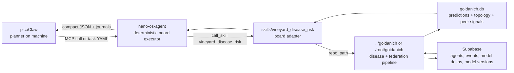

# picoClaw, nano-os-agent, and Goidanich Coordination

This repository is the hardware executor. The adjacent `../goidanich` project is
the vineyard disease model and federated learning project. picoClaw is the
planner installed on the machine, and it should coordinate both through stable
interfaces instead of improvising board shell commands.

## Three Actors



The important rule is separation of responsibility:

- picoClaw decides intent, asks for summaries, and can create or launch tasks.
- nano-os-agent owns execution, retries, timeouts, locks, journals, and hardware
  boundaries.
- Goidanich owns disease math, weather ingestion, feedback, neighbour discovery,
  and federated model exchange.

## Smooth Control Paths

### Immediate status

picoClaw calls the board skill:

```yaml
action: call_skill
parameters:
  skill_name: vineyard_disease_risk
  repo_path: /root/goidanich
  mode: current_status
  disease: downy_mildew
```

During development on the colocated machine, use:

```yaml
repo_path: /Users/vbaulin/antigr/goidanich
```

The wrapper also falls back to that development path if `/root/goidanich` is not
present.

### Daily cron

Use `mode: cron_daily` for the once-per-day job. It creates a lock in
`results/.vineyard_disease_daily.lock`, runs `daily_update.py`, and returns the
latest prediction rows.

This is safer than asking picoClaw to run:

```text
python3 daily_update.py ...
```

directly, because the skill returns structured JSON, prevents duplicate model
runs, and keeps the executor journal as the source of truth.

Recommended scheduling pattern:

```text
cron/systemd/picoClaw scheduler
  -> create or mark vineyard_disease_cron_daily task pending
  -> nano-os-agent runs the template once
  -> picoClaw reads compact result when needed
```

Do not use a 24-hour shell loop from picoClaw. If the board is dedicated only to
disease monitoring, a task `repeat.interval_sec: 86400` can work, but external
cron/systemd is easier to restart, inspect, and disable.

### Neighbour refresh

Use `mode: sync_neighbours` to load the updated list of neighbours:

```text
supabase_sync.py --pull-neighbours
stations.py
```

This writes `neighbours.yaml` and rebuilds SQLite `topology`. The task template
is [tasks/025_vineyard_federated_neighbour_refresh.yaml](tasks/025_vineyard_federated_neighbour_refresh.yaml).

The board should not discover neighbours by scanning IPs or opening HTTP ports
on other boards. Supabase is the shared coordination layer. Agents are found by
registered board/field metadata, distance, disease task, and released model
state.

### Federated learning maintenance

The `vineyard_disease_risk` skill exposes explicit modes:

- `register_agent`: upsert this board and fields into Supabase.
- `push_events`: publish confirmed local feedback/treatment/inspection events.
- `pull_events`: pull peer/regional disease events.
- `sync_neighbours`: refresh `neighbours.yaml` and SQLite topology.
- `push_model_deltas`: publish clipped local model summaries.
- `pull_model_version`: download the latest released shared model.
- `sync_all`: run the broad maintenance pass and rebuild topology.

Daily update already performs the normal combination when enabled in
`network_config.yaml`, but these separate modes matter because picoClaw can
repair or inspect one coordination layer without launching a full model run.

## Board vs Machine Runtime

The LicheeRV Nano can run compact Go helpers and deterministic board skills
well. The full Goidanich daily pipeline may use Python libraries such as pandas
and numpy, depending on deployment. There are two valid deployments:

- **Board-heavy:** `/root/goidanich` is provisioned on the board; nano-os-agent
  calls the skill locally.
- **Gateway-heavy:** picoClaw and Goidanich run on the colocated machine; the
  board still owns hardware observations and can call only compact risk/status
  skills or compiled Go scorers.

In both cases picoClaw should talk through the skill/task contract. That is what
prevents the earlier failure mode where picoClaw treated the board as a full
Linux workstation.

## What Makes This Powerful

The disease board is not just a camera or a weather script. It becomes a local
scientific station:

1. It observes field conditions, farmer feedback, and regional disease events.
2. It runs deterministic priors such as Goidanich and Rossi.
3. It learns local corrections from labels.
4. It exchanges clipped model deltas and released shared models.
5. It refreshes neighbours automatically as new boards join.
6. It produces compact daily risk summaries without burning LLM tokens.

picoClaw can then spend reasoning only where it is valuable: explaining a risk
jump, proposing a new experiment, comparing fields, or deciding whether the
board needs a new skill.
