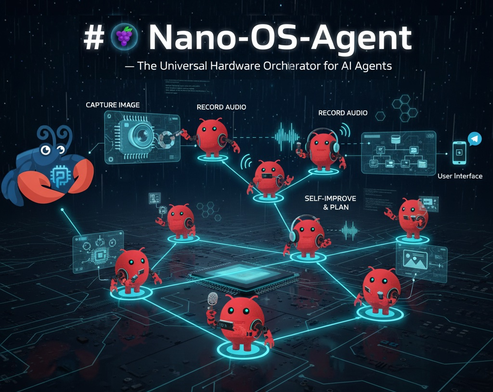
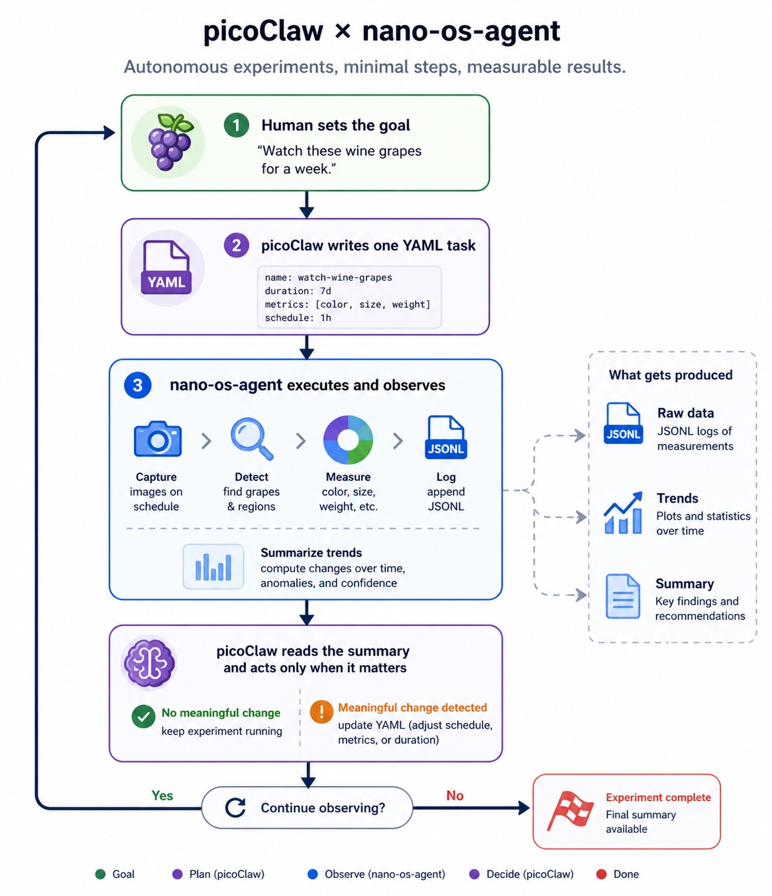
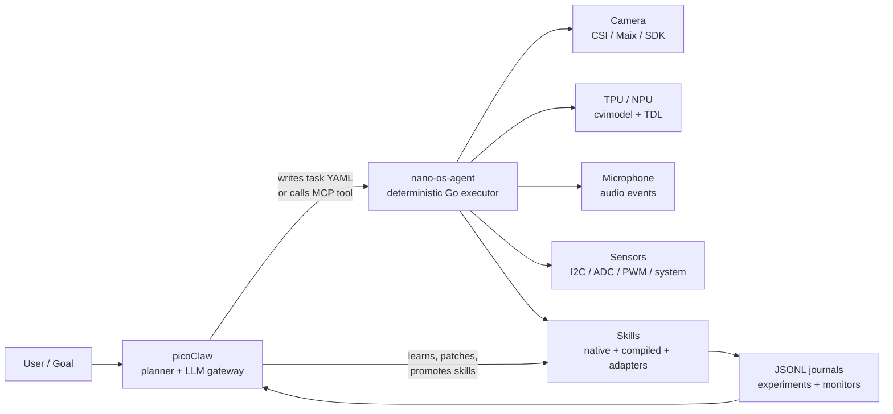
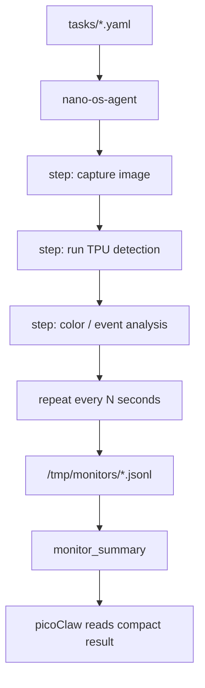
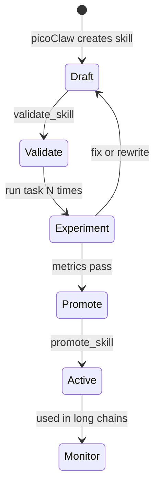

# Nano-os-agent - Autonomous Hardware Executor for picoClaw



**nano-os-agent** turns a 10$ LicheeRV Nano into a patient, local hardware researcher. It is the deterministic body for **picoClaw**: picoClaw decides goals and asks for reasoning over WiFi, while nano-os-agent runs camera, TPU, microphone, sensors, skills, retries, journals, and long-term monitoring on the board.

The advance is simple and powerful: the LLM does not babysit hardware. It gives intent once. With 1W power consumption the board acts for minutes, hours, or days.

Such low cost board becomes really interesting when we stop thinking of it as "camera + mic + TPU" and start thinking of it as a **low-cost autonomous experiment station**:

```text
observe -> perturb -> measure -> learn -> summarize
```

It can watch grapes ripen, detect grass stress, run lab protocols, verify robot actions, collect datasets, and promote new skills from local evidence.
It can also run bounded active-inference-style loops: maintain a small belief state, choose the next local action, observe the result, and update the belief without waking the LLM.




## Why This Matters

Most AI hardware projects fail at the boundary between language and physics. The model can plan, but the board has driver quirks, memory pressure, camera initialization, NPU model formats, audio contention, flaky sensors, and slow environmental change.

nano-os-agent makes that boundary boring:

- **picoClaw is the brain**: asks questions, designs experiments, writes or improves skills, uses the LLM when reasoning is worth the WiFi/token cost.
- **nano-os-agent is the field executor**: runs deterministic chains, handles retries, records evidence, exposes MCP tools, and keeps working without supervision.
- **Skills are the evolving hands**: camera, TPU, microphone, GPIO, I2C, color analysis, event detection, learned classifiers, and future board-specific abilities.
- **Journals are memory**: every experiment creates before/after metrics and compact JSONL evidence that picoClaw can read later.

## Application Atlas

Each application is a different way to use the same core loop: local sensing, local action, compact evidence, and occasional high-level reasoning.

- [Autonomous vineyard and plant research](docs/applications/vineyard-plant-research.md) - phenology, ripeness, leaf stress, wetness, and growth trends.
- [Grass and field motion intelligence](docs/applications/grass-field-motion.md) - wind proxy, water stress, mowing events, and day/night color changes.
- [Automatic lab experiment runner](docs/applications/automatic-lab-experiments.md) - timed sample observation, reaction endpoints, liquid levels, germination, and protocol search.
- [Wine fermentation monitor](docs/applications/wine-fermentation-monitor.md) - alcohol-conversion proxies, pH/temperature trends, bubbling, turbidity, and batch knowledge graphs.
- [Petri dish colony counting](docs/applications/petri-colony-counting.md) - colony count, growth curves, contamination cues, inhibition zones, and treatment/control comparison.
- [Closed-loop robot manipulation](docs/applications/robot-manipulation.md) - visual servoing, actuation verification, safe retries, and local reflex loops.
- [Active inference tasks](docs/applications/active-inference-tasks.md) - belief updates, action scoring, local policy loops, and preferred observations.
- [Environmental event sentinel](docs/applications/environmental-event-sentinel.md) - audio triggers, visual confirmation, storm cues, I2C/system snapshots, and evidence packs.
- [Machine health monitor](docs/applications/machine-health-monitor.md) - status LEDs, gauges, startup checks, audio drift, and machine-specific baselines.
- [Automatic dataset builder](docs/applications/automatic-dataset-builder.md) - hard negatives, uncertainty capture, local labels, and model/skill evaluation.
- [Scientific reflexes](docs/applications/scientific-reflexes.md) - baseline learning, anomaly scoring, adaptive intervals, change points, and daily summaries.
- [Self-improving field/lab observer](docs/applications/self-improving-field-lab-observer.md) - the full loop where the board becomes specialized to its place.

## Agentic Architecture



The important loop is not "LLM calls shell forever." It is **intent -> deterministic chain -> evidence -> better skill**.

## What Runs Locally



Task steps can:

- call any skill with `call_skill`;
- repeat locally with `repeat.interval_sec`;
- write one JSON object per observation to a journal;
- continue through temporary failures;
- pass outputs to later steps using `${step_id.field}`;
- finish with a summary instead of thousands of chat turns.

Example:

```yaml
- id: grape_growth_monitor
  name: "Wine Grape Growth and Ripeness Monitor"
  priority: 6
  status: pending
  steps:
    - id: observe_grapes
      action: call_skill
      save_as: grapes
      parameters:
        skill_name: observe_scene
        label: grapes
        output_dir: /tmp/observations/grapes
      expect: {status: success}
      repeat:
        interval_sec: 3600
        max_iterations: 168
        journal_path: /tmp/monitors/grape_growth.jsonl
        continue_on_fail: true

    - id: summarize_grapes
      action: call_skill
      parameters:
        skill_name: monitor_summary
        journal_path: /tmp/monitors/grape_growth.jsonl
      expect: {status: success}
```

That one task can observe for a week. picoClaw does not need to spend tokens every hour.

## A Real Change Example

Imagine the board is installed near a grape row.

1. picoClaw writes `grape_growth_monitor` and marks it `pending`.
2. nano-os-agent captures one frame every hour.
3. `observe_scene` runs camera capture, TPU detection, and color analysis.
4. The board journals compact rows like:

```json
{
  "timestamp": "2026-05-01T09:00:00+0200",
  "label": "grapes",
  "image_path": "/tmp/observations/grapes/grapes_20260501_090000.jpg",
  "object_count": 4,
  "color": {
    "green_ratio": 0.41,
    "purple_ratio": 0.12,
    "ripeness_estimate": 0.22,
    "stress_estimate": 0.08
  }
}
```

1. After two days, `monitor_summary` reports that `yellow_ratio` and `brown_ratio` are rising quickly while visible cluster count is dropping.
2. picoClaw asks the LLM once: "This trend may indicate leaf stress or bad framing. What should we test?"
3. picoClaw creates a draft skill: `leaf_stress_score`.
4. nano-os-agent validates it with `validate_skill`, runs an experiment, and promotes it with `promote_skill` only if it works.
5. The running monitor is updated to include the new skill.

The board has made a real change: it moved from generic observation to a new domain-specific measurement, without changing the core Go executor and without asking the LLM to watch every frame.

## Skill Lifecycle



This separation is deliberate:

- Draft skills can be creative and imperfect.
- Promoted skills are trusted by unattended monitors.
- The Go executor stays small and reliable.

Runtime preference:

1. **Go in `main.go`** for deterministic primitives, MCP, task execution, safety, and journaling.
2. **C/C++ SDK binaries** for camera, TPU, and zero-copy vision.
3. **Compiled Go helper binaries** for CPU-side analysis and summaries.
4. **Python adapters** when the Maix/vendor stack exposes a working binding there first, or when picoClaw is prototyping.

The intended path is:

```text
prototype quickly -> validate with repeated experiments -> rewrite as compiled helper -> promote
```

## Hardware Capabilities

The LicheeRV Nano gives the agent a compact but serious sensor/compute stack:

- **Camera**: CSI MIPI capture, frame journaling, color indices, visual change detection.
- **TPU/NPU**: INT8 `.cvimodel` inference through Cvitek/Sophgo TDL paths.
- **Microphone**: audio capture and local event detection.
- **System probes**: memory, thermal, video devices, dmesg, I2C, ADC, PWM, GPIO.
- **MCP server**: picoClaw can call board tools directly.
- **File-driven autonomy**: tasks and skills can be created, validated, and promoted locally.

## MCP Tools Exposed to picoClaw

Typical tools:

- `capture_image` - capture a CSI frame.
- `capture_audio` - record a short WAV sample.
- `capture_video` - record a short video clip.
- `run_yolo` - run TPU/NPU detection and attach perception atoms when possible.
- `analyze_image` - convert detections into structured perception atoms.
- `scan_i2c` - scan an I2C bus.
- `probe_cvitek` - inspect camera/NPU related board state.
- `adc_read` - read SARADC values.
- `pwm_control` - control PWM channels.
- `time_sync` - synchronize or inspect board time.
- `call_skill` - call any registered skill by name.
- `get_visual_truth`, `get_experiments`, `get_hypotheses` - read compact state.

## Built-In Monitoring Templates

The repository includes long-running templates marked `status: template` so they do not start accidentally:

- [tasks/020_grape_growth_monitor.yaml](tasks/020_grape_growth_monitor.yaml) - grape color, ripeness, stress, and visible object trend.
- [tasks/021_grass_day_monitor.yaml](tasks/021_grass_day_monitor.yaml) - grass movement and color throughout the day.
- [tasks/022_environment_event_guard.yaml](tasks/022_environment_event_guard.yaml) - microphone/system/environment event journal.
- [tasks/023_promote_learned_skill.yaml](tasks/023_promote_learned_skill.yaml) - validate and promote a picoClaw-created skill.

## Why The Deterministic Executor Is The Must

An LLM is excellent at asking "what should we try next?" It is poor at being a reliable camera driver, process supervisor, file logger, retry loop, and week-long sensor operator.

nano-os-agent gives picoClaw a body with reflexes:

- It can fail locally and recover locally.
- It can collect evidence while the LLM is offline.
- It can reduce thousands of samples to one trend summary.
- It can promote learned skills without recompiling the executor.
- It can turn a cheap board into a domain-specific observer over time.

That is the agentic jump: not a chatbot attached to hardware, but a hardware organism that can be given missions.

## Build

Cross-compile for the SG2002 board:

```bash
GOOS=linux GOARCH=riscv64 CGO_ENABLED=0 go build -o nano-os-agent main.go
```

Run on the board:

```bash
/root/nano-os-agent
```

The agent scans `tasks/*.yaml`, exposes MCP on `0.0.0.0:9600`, writes state to `state.json`, and appends experiment evidence to the configured journal.

For board setup, library paths, and CMA notes, see [INSTALL_BOARD.md](INSTALL_BOARD.md).

## Stability Notes

- Prefer `/tmp` for transient images, audio, and monitor journals to reduce SD-card wear.
- Promote compiled Go/C/C++ skills for hot loops and long-term monitors.
- Keep Python skills where they are the most reliable available adapter, especially for Maix SDK bindings.
- Use `status: template` for example tasks that should not launch automatically.
- Use `monitor_summary` to give picoClaw compact trend evidence instead of raw logs.
