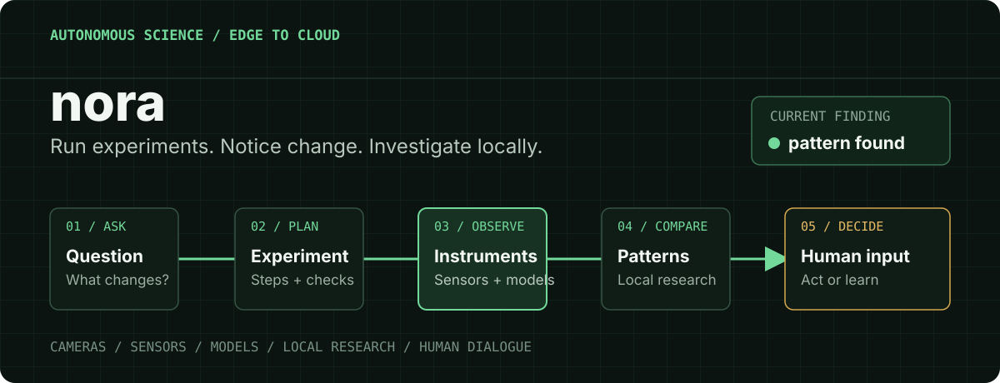
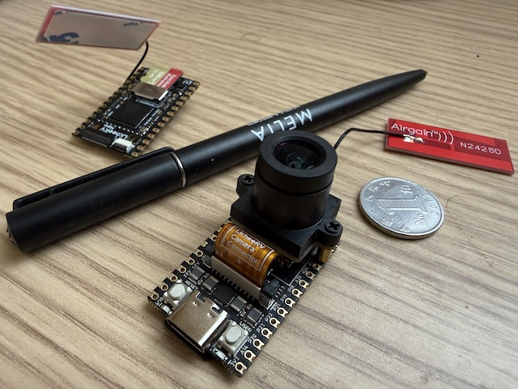
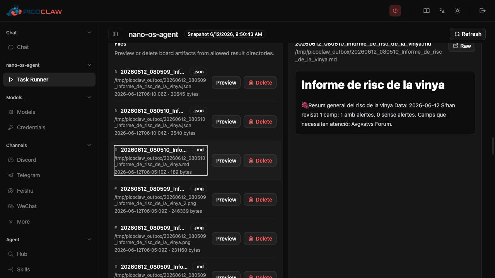
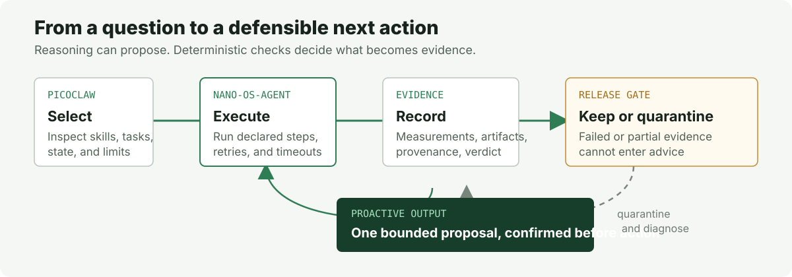

<p align="center">
  
</p>

<p align="center">
  <a href="go.mod"></a>
  <a href="https://wiki.sipeed.com/hardware/en/lichee/RV_Nano/1_intro.html"></a>
  <a href="docs/tutorial-proactive-field-companion.md"></a>
  <a href="https://vbaulin.github.io/nora/"></a>
</p>

**nora** (nano-os-agent) is an autonomous research executor. PicoClaw reasons
about goals and selects capabilities; the executor runs declared steps, handles
retries and timeouts, records measurements and artifacts, and releases only
results that satisfy explicit checks. Between samples, the research engine
studies what was recorded.

> The LLM may design or revise an experiment. It does not babysit the hardware
> loop or convert an unverified observation into a fact.

nora is a general research implementer, not a product for one field. The same
engine runs a bench rig and a vineyard; a domain arrives as a pack of
parameters. See [REPO_BOUNDARY.md](REPO_BOUNDARY.md) for the layering.

It is also not tied to one host. The executor is a static Go binary for
x86-64, ARM and RISC-V, and the research engine is standard-library Python, so
the same tree runs on a LicheeRV Nano, a laptop, or a cloud VM. Skills that
need peripherals declare `requires_hardware: true` and are skipped with a
stated reason where there are none. See [`deploy/`](deploy/README.md).

[Read the tutorial](https://vbaulin.github.io/nora/) or use the
[single-page operator tutorial](docs/tutorial-proactive-field-companion.md).

## Research on Idle Time

A sampling board is idle almost all the time. `skills/research_agent` spends a
few of those seconds raising questions from the journals the tasks wrote,
answering them with bounded analyses, and handing back only what a human should
decide. It runs on a laptop too:

```bash
printf '%s' '{"mode":"cycle","state_dir":"/tmp/nora/state","journal_dirs":"/tmp/monitors"}' | ./skills/research_agent/run.sh
```

| Verdict | Meaning | Reaches a human |
| --- | --- | --- |
| `material_unresolved` | Real, decision-relevant, unanswerable locally | Yes |
| `not_material` | Real, but it changed no decision | No |
| `resolved_local` | Already answered by evidence on the board | No |
| `insufficient_data` | The analysis could not run | No |

A board that cannot check something has discovered nothing, and must not turn
its own blind spot into a request for attention or hardware.

## Evidence Before Explanation

<table>
  <tr>
    <td width="44%" valign="top">
      
      <br><sub>Physical target: LicheeRV Nano with CSI camera and SG2002 compute.</sub>
    </td>
    <td width="56%" valign="top">
      
      <br><sub>Operator surface: tasks, artifacts, rendered reports, and deletion controls.</sub>
    </td>
  </tr>
</table>

The executor is useful anywhere observation must continue after an LLM turn
ends: microscope timelapses, fermentation, machine health, environmental
sensing, field experiments, dataset construction, or verification of robotic
actions. Vineyard Guard is the complete reference application because it
exercises scheduling, weather and disease models, plots, Telegram delivery,
Supabase synchronization, and human confirmation under field conditions.

<p align="center">
  
  <br><sub>Original project artwork, retained as the early concept for a board with reusable sensing skills.</sub>
</p>

## Architecture

<p align="center">
  
</p>

| Layer | Responsibility |
|---|---|
| **PicoClaw** | Interpret intent, inspect skills and current artifacts, choose a capability, and explain released evidence. |
| **nano-os-agent** | Execute task steps and native skills with expectations, retries, timeouts, metrics, and journals. |
| **Research engine** | Raise questions from journals and feedback, answer them with bounded analyses, and keep the verdicts and their limits. |
| **Domain pack** | Declare the questions a field always cares about, as parameters for those analyses. |
| **Application adapter** | Convert domain artifacts into observations, deliver findings, and define bounded proposal and confirmation rules. |

Hardware access follows one route:

```text
PicoClaw intent
  -> MCP tool or task YAML
  -> nano-os-agent skill/native handler
  -> camera, NPU, sensor, actuator, or model
  -> structured result + experiment journal
```

Direct, unjournaled camera, NPU, GPIO, I2C, PWM, or long-running shell loops
break this contract. See [HARDWARE_BOUNDARY.md](HARDWARE_BOUNDARY.md) and the
gateway-facing [orchestrator prompt](PICOCLAW_ORCHESTRATOR_PROMPT.md).

## First Experiment

Build the static binary for the host you have:

```bash
GOOS=linux GOARCH=riscv64 CGO_ENABLED=0 go build -o nano-os-agent main.go  # LicheeRV Nano
GOOS=linux GOARCH=amd64   CGO_ENABLED=0 go build -o nora main.go           # cloud VM
GOOS=linux GOARCH=arm64   CGO_ENABLED=0 go build -o nora main.go           # Ampere, Graviton, Pi
go build -o nora main.go                                                   # your machine
```

Run one read-only task on a configured board:

```yaml
- id: tutorial_system_snapshot
  name: "Tutorial system snapshot"
  priority: 1
  status: pending
  steps:
    - id: read_system
      action: call_skill
      parameters:
        skill_name: system_info
      expect:
        ram_total_mb: ">=1"
      timeout: 15
      on_fail: block
```

```bash
/root/nano-os-agent/nano-os-agent --once tutorial_system_snapshot.yaml
tail -1 /root/nano-os-agent/experiments.jsonl
```

The meaningful output is the task verdict linked to its executed steps,
measurements, and artifacts. A failed expectation remains failed or partial;
PicoClaw may diagnose it, but it cannot relabel it as success.

For board installation, memory limits, camera setup, and service integration,
use [INSTALL_BOARD.md](INSTALL_BOARD.md).

## Task Contract

Tasks are YAML-defined experiment chains. A step can call a skill, retain a
named result, assert expected fields, retry, continue after a temporary failure,
or repeat locally into a compact JSONL monitor.

```yaml
- id: environmental_baseline
  name: "Environmental baseline"
  priority: 3
  status: template
  steps:
    - id: snapshot
      action: call_skill
      save_as: environment
      parameters:
        skill_name: sensor_fusion_snapshot
      expect:
        status: success
      repeat:
        interval_sec: 300
        max_iterations: 288
        journal_path: /tmp/monitors/environmental_baseline.jsonl
        continue_on_fail: true
```

The executor can pass earlier outputs to later steps with
`${step_id.field}` or `${save_as.field}`. Long monitors stay local; PicoClaw
reads a compact summary or an anomaly rather than spending one model turn per
sample.

## Skill Lifecycle

```text
draft -> validate -> repeated experiment -> evidence -> promote -> monitor
  ^          |               |                              |
  +----------+---------------+------------------------------+
                  revise on failure or drift
```

- **Draft skills** may be incomplete and are not trusted for unattended use.
- **Validation** checks declared inputs, outputs, safety, and execution.
- **Experiments** produce before/after metrics and artifacts.
- **Promotion** requires passing evidence; failed and partial runs remain
  quarantined.
- **Revalidation** is required when hardware, models, or environmental
  conditions change.

Runtime preference is native Go for deterministic primitives, vendor C/C++ for
camera and zero-copy NPU paths, compiled Go helpers for CPU analysis, and Python
for vendor bindings or early prototypes.

## Proactive Interaction

The adapter converts a stream of measurements into a sparse sequence of useful
interactions. Its unit of work is not a conversation turn, but an
evidence-linked proposal with a subject, reason, priority, provenance, and
next observation.

| Proactive capability | Observable behaviour |
|---|---|
| **Evidence-triggered attention** | A scheduled `tick` reads fresh artifacts, task verdicts, field profiles, and confirmed operations, then reacts to a declared change, discrepancy, or missing parameter. |
| **One high-value question** | The runtime ranks candidate proposals and creates at most one new proposal per subject, reducing repeated prompts while preserving unresolved questions. |
| **Context-bearing dialogue** | Every actionable prompt receives a `PF-<id>`. Informal replies are resolved to the pending subject, field, experiment, and disease before any record is drafted. |
| **Structured confirmation** | Free-form observations and operations become a structured draft. Missing field, time, product, quantity, or outcome information is requested before a confirmed write. |
| **Outcome follow-up** | After an operation-specific delay, the companion asks once for the later observation. The resulting sequence is retained as an association, providing material for subsequent experiments. |
| **Selective notification** | A proposal reaches Telegram only above its configured priority threshold. Signals already covered by the daily briefing are marked `skipped_covered` rather than sent twice. |
| **Bounded research** | An unresolved capability or failed experiment can open one focused source search. URLs and snippets enter a review proposal, not an operating instruction. |
| **Experiment-to-memory learning** | nano-os-agent results enter reusable memory only when the executed steps are internally consistent and satisfy their declared expectations. |

### A Proactive Cycle

```text
07:00  A scheduled tick observes a changed measurement and its source artifact.
07:00  The companion selects one question: "Inspect sample A for morphology X. Ref: PF-12"
09:14  The operator replies informally: "PF-12: absent; image looks clear."
09:14  proposal_context resolves sample A + experiment X without writing.
09:15  A structured observation is shown for confirmation.
Day +2 The next tick links the confirmed outcome to the earlier operation,
       retains temporal order, and proposes a controlled comparison if useful.
```

This cycle can begin from a sensor excursion, a camera-derived change, a failed
task expectation, a missing experimental covariate, an overdue observation, or
a source-attributed research result. The same machinery supports laboratory
samples, machines, fermentation batches, robots, environmental stations, and
field plots.

The reference `proactive-field-agent` uses `PF-<id>` references so informal
Telegram replies can be resolved to one field and one pending question. An
accepted proposal does not mean that treatment or another operation occurred.
Confirmed operations and later observations are retained as temporal
associations with `causal_claim=false` unless an experimental design supports
a stronger inference.

Start with the [chaptered GitHub Pages tutorial](https://vbaulin.github.io/nora/)
or inspect the [skill contract](skills/proactive_field_agent/SKILL.md).

## Application Atlas

The executor is general; application adapters provide domain observations and
policies.

| Application | What becomes evidence |
|---|---|
| [Microscope timelapse](docs/applications/microscope-timelapse.md) | Focus, illumination, segmented objects, growth, and anomaly-triggered sampling. |
| [Automatic lab experiments](docs/applications/automatic-lab-experiments.md) | Timed sample observations, reaction endpoints, liquid levels, and protocol checks. |
| [Fermentation monitor](docs/applications/wine-fermentation-monitor.md) | Temperature, pH, bubbling, turbidity, batch trends, and confirmed operations. |
| [Machine health](docs/applications/machine-health-monitor.md) | Status LEDs, gauges, startup checks, audio drift, and machine-specific baselines. |
| [Robot manipulation](docs/applications/robot-manipulation.md) | Visual servoing, action verification, bounded retries, and local reflexes. |
| [Dataset builder](docs/applications/automatic-dataset-builder.md) | Hard negatives, uncertainty samples, labels, and model/skill evaluation. |
| [Vineyard and plant research](docs/applications/vineyard-plant-research.md) | Phenology, ripeness, stress, wetness, growth, disease models, and field feedback. |

The complete list is in [docs/applications](docs/applications).

## Vineyard Guard Reference Application

Vineyard Guard is an optional application connected to the private Goidanich
repository. It remains separate from the universal PicoClaw and nano-os-agent
runtimes. Its public integration contracts cover:

- independent downy mildew, powdery mildew, and grapevine black-rot routes;
- fresh daily cache generation and disease-specific plots;
- concise scheduled Telegram summaries and full reports on demand or alert;
- catalog-checked, two-step farmer feedback and treatment confirmation;
- board and field identity, SIGPAC-enriched provisioning, and Supabase sync;
- field memory and proactive questions grounded in current model artifacts.
- observed April-to-harvest climate summaries with monthly rainfall,
  day/night conditions, heat/wetness indices, and calibration-ready Brix
  features through `vineyard-season-climate`.

Read [VINEYARD_GUARD.md](VINEYARD_GUARD.md), the
[disease-model contract](docs/applications/vineyard-disease-risk-models.md),
and the [SD-card provisioning guide](docs/vineyard-sd-card-provisioning.md).

## Repository Map

| Path | Purpose |
|---|---|
| [`main.go`](main.go) | Task engine, MCP server, safety checks, state, and experiment journal. |
| [`program.yaml`](program.yaml) | Human-owned research goals, hypotheses, metrics, and constraints. |
| [`tasks/`](tasks) | One-shot experiments and long-running templates. |
| [`skills/`](skills) | Reusable capabilities and application adapters. |
| [`pico/`](pico) | PicoClaw launcher/web integration. |
| [`docs/`](docs) | Runtime contracts, applications, deployment, and tutorials. |
| [`scripts/`](scripts) | Board synchronization, provisioning, schedulers, and maintenance. |

## Operational Limits

- The target has 256 MB RAM; camera/NPU reservations leave substantially less
  for user processes. Long-running skills must remain compact.
- Transient images, audio, and monitor journals belong in `/tmp` when durable
  retention is unnecessary, reducing SD-card writes.
- A model output is not a confirmed physical event. Preserve model identity,
  units, inputs, uncertainty, and field or laboratory confirmation.
- Internet snippets are candidate evidence, never automatic operating or
  treatment instructions.
- Human corrections are drafted into structured form before they are written.
- `status: template` prevents example monitors from starting accidentally.

## Further Reading

- [Tutorial: build an autonomous research executor](docs/tutorial-proactive-field-companion.md)
- [Autonomous task patterns](AUTONOMOUS_TASKS.md)
- [Self-improving runtime design](SELF-IMPROVING.md)
- [Skill reconciliation](SKILLS_RECONCILIATION.md)
- [PicoClaw and Goidanich coordination](PICOCLAW_GOIDANICH_COORDINATION.md)
- [PicoClaw gateway board synchronization](docs/picoclaw-gateway-board-sync.md)
- [PicoClaw webapp and nano-os-agent integration](docs/picoclaw-nano-webapp-integration.md)

The README visual system follows the inspection-first workflow from
[beautify-github-readme](https://github.com/oil-oil/beautify-github-readme).
The chaptered tutorial structure is adapted from
[PocketFlow Tutorial Codebase Knowledge](https://github.com/The-Pocket/PocketFlow-Tutorial-Codebase-Knowledge);
its content is manually verified against this repository rather than claimed
as an automatically generated analysis.
