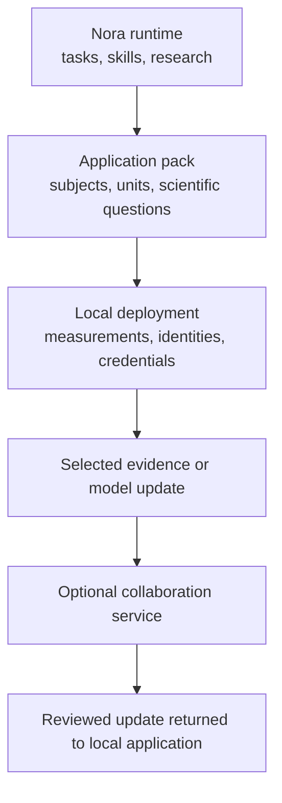

# Build Applications Without Giving Up Your Data

Nora separates reusable scientific machinery from the measurements, identities,
credentials, and models of one deployment. That separation lets a team share a
sensor skill or experimental method without publishing its samples, locations,
participants, treatment history, or private model source.

This is useful well beyond software maintenance. Research groups and local
communities often need to collaborate while retaining control over sensitive or
commercially valuable observations.

## What You Can Share

The reusable layer can include:

- the task executor and experiment format;
- camera, sensor, NPU, audio, GPIO, and analysis skills;
- validation and skill-promotion methods;
- the local research engine;
- generic application adapters and synthetic examples;
- deployment scripts that contain no credentials; and
- the scientific method expressed as task templates.

A published skill can answer, for example, "how do we obtain a calibrated leaf
image?" or "how do we count colonies under this microscope?" without
containing the images collected by one study.

## What Can Remain Local

An application or deployment can keep:

- sample, patient, field, machine, or participant identities;
- exact locations and network addresses;
- raw images, audio, measurements, journals, and databases;
- credentials, API keys, Telegram recipients, and cloud configuration;
- private models and application source;
- confirmed operations, labels, interventions, and outcomes; and
- generated reports, plots, and model artifacts.

Keeping these items outside the reusable runtime also prevents a second board
from inheriting the first deployment's identity.

## The Application Pattern



The parts answer different questions:

| Layer | Question |
|---|---|
| **Nora runtime** | How is an experiment run, recorded, investigated, and extended? |
| **Application pack** | What subjects, measurements, models, and decisions matter in this field? |
| **Local deployment** | Which real instruments, people, locations, and observations belong to this installation? |
| **Collaboration service** | Which selected results should be exchanged, aggregated, or reviewed? |

An application activates only when its local files are present. Nora can still
run generic experiments without that application.

## Example: A Microscope Network

Several laboratories can use the same:

- camera initialization skill;
- focus-quality calculation;
- illumination normalization;
- segmentation task;
- artifact naming convention; and
- experiment journal schema.

Each laboratory keeps its own sample identities and images. It may publish a
tested skill improvement or a model update after local evaluation. Another
laboratory can validate that update against its own samples before using it.

The shared object is a method or selected model information, not an automatic
copy of every observation.

## Example: Vineyard Guard

Vineyard Guard uses the same pattern:

```text
public or reusable Nora layer
  experiment runner
  research engine
  hardware skills
  generic field adapter interfaces

private application layer
  disease-model implementation
  field identities and coordinates
  weather cache and local database
  grower feedback and treatment history
  credentials and generated plots
```

The field boards can exchange selected alerts, validated model deltas, or
released model versions through an application service. Each board first
evaluates a shared model against local labelled outcomes. Raw field history can
remain local.

This arrangement supports collaboration without asserting that one regional
model performs equally at every plot.

## Create Your Own Application

### 1. Define subjects

Choose stable identifiers for samples, batches, machines, plots, or other
experimental units. Keep real identities in private configuration when needed.

### 2. Define observations

Name fields, units, source, timestamp, freshness, and uncertainty. Decide which
artifacts are transient and which belong in the study record.

### 3. Define domain questions

Describe questions the application should routinely ask, such as:

- did morphology change beyond focus and illumination variation?
- did a process deviate from its own historical trajectory?
- do two instruments disagree enough to change the next measurement?
- did an operation precede a repeatable outcome worth testing?

These questions parameterize general analyses where possible. Application code
is needed when the scientific model itself is domain-specific.

### 4. Define human contributions

Specify which labels, observations, or operations can arrive through chat and
which fields require confirmation. Keep a proposal, a confirmed operation, and
a later outcome as distinct records.

### 5. Decide what may leave the device

For each data class, choose:

- local only;
- synchronized to a trusted service;
- aggregated before synchronization;
- shared as a model update; or
- publishable with the study.

Make this a deployment choice rather than a hidden behavior of the runtime.

### 6. Test without the private application

Nora should start, list generic skills, run a system experiment, and display
the application as unavailable when its local repository is absent. This
confirms that the reusable system does not depend on private data.

## Repository Layout

A practical public/private split is:

```text
nora/
  main.go
  skills/
  tasks/
  pico/
  docs/
  scripts/

private-application/
  config/
  models/
  database/
  results/
  private skills and adapters
```

On a board, selected private skills can be mounted into PicoClaw's discovery
directory while the authoritative source remains in the private application.
Copying is unnecessary and can create divergent versions.

```text
/root/nano-os-agent
  reusable runtime and instrument skills

/root/.picoclaw/workspace/private-application
  local application checkout and data

/root/.picoclaw/workspace/skills
  discovery links or bind mounts to the selected skills
```

## Collaboration and Federated Learning

Federated learning is an application choice, not a synonym for synchronization.
A sound deployment records:

- the local training window and labelled outcomes;
- model version and parameters;
- the delta or aggregate that leaves the board;
- validation of a returned model on local data; and
- whether the returned model was accepted.

A board with too few labels should continue using its validated deterministic
models rather than publishing placeholder coefficients. Human corrections are
valuable because they can create the positive and negative examples needed for
later calibration.

## Maintainer Checklist

Before publishing a repository or deployment image:

1. scan for credentials, tokens, addresses, exact locations, and recipient IDs;
2. exclude databases, journals, generated media, caches, and private models;
3. replace real identities with synthetic examples;
4. build and test the runtime without the private application;
5. verify that private skills are mounted or linked rather than copied into
   divergent locations; and
6. document which data leave the device and why.

## Continue

- [Build an application for your domain](docs/proactive-agent/08-vineyard-guard.md)
- [Working with physical hardware](HARDWARE_BOUNDARY.md)
- [Application atlas](docs/applications)
- [PicoClaw and nano-os-agent web integration](docs/picoclaw-nano-webapp-integration.md)
