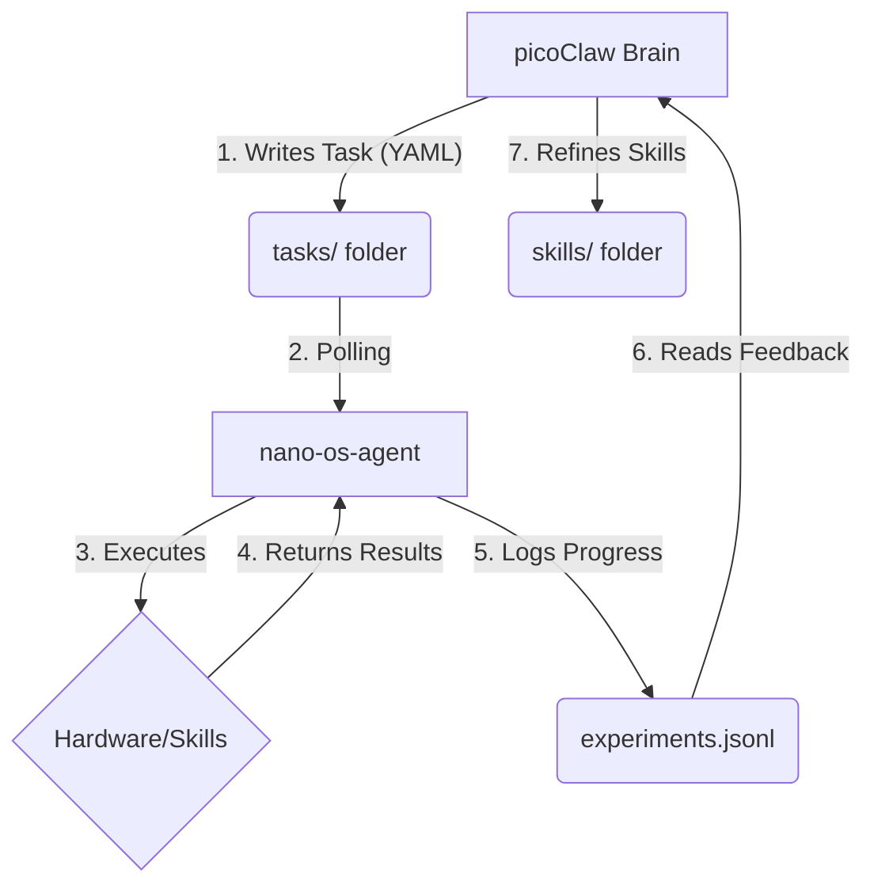

# Self-Improving Hardware Research Loop

This document explains the autonomous interaction between the **picoClaw Brain** (LLM) and the **nano-os-agent** (Go Hardware Orchestrator) on the LicheeRV Nano (SG2002).

## 1. The Core Architecture
The system follows a strictly decoupled, file-driven architecture. The Go agent handles the physical world, while the picoClaw Brain handles the logic and research agenda.

## 2. How the Parts Work Together

### nano-os-agent (The Nervous System)
*   **Role**: Hardware Relay & Task Runner.
*   **Behavior**: It is a stable, compiled Go binary that never needs to change. It watches the `tasks/` directory and executes instructions.
*   **Truth Engine**: It maintains the "Command Truth" (CLI outputs) and "Visual Truth" (CSI Camera frames) in `state.json`.

### picoClaw (The Brain)
*   **Role**: Scientist & Strategist.
*   **Behavior**: It reads the research goals in `program.yaml` and determines what to do next. It communicates with the agent solely by **modifying files**.

## 3. The "Learning" Process (Skill Evolution)

Learning in this system is defined as the **autonomous creation and refinement of skills** without recompiling the Go agent.

### Step 1: Capability Gap Discovery
The Brain realizes it needs a new capability (e.g., "detect a specific color pattern"). It searches its `skills/` directory and sees the skill is missing.

### Step 2: Skill Registration
The Brain writes a new folder to the `skills/` directory:
1.  **`SKILL.md`**: Defines the name, input parameters, and expected output format.
2.  **`run.py` (or `run.sh`)**: The actual implementation code.

The Go Agent **instantly registers** this skill in its cache as soon as the folder appears.

### Step 3: Experimental Validation
The Brain writes a task to `tasks/` that calls this new skill. The Agent executes it and captures the result.

### Step 4: Iterative Refinement (Self-Improvement)
*   **If the skill fails**: The Brain reads the error logs in `experiments.jsonl`, identifies the bug (e.g., a logic error or missing dependency), and **rewrites the skill file**.
*   **If the skill succeeds**: The Brain marks the hypothesis as "tested" and archives the successful skill as a permanent tool for future experiments.

## 4. Hardware Optimization (SG2002 Specifics)
To ensure the learning process is stable on the LicheeRV Nano, the agent uses specific hardware safeguards:
*   **ION Heap Management**: All vision skills are locked into 2-buffer heap mode to prevent memory exhaustion during long-running research loops.
*   **CMA-Agnostic Execution**: The agent assumes `cma=0` and optimizes its Python/NPU fallbacks accordingly.

## 5. Using Native C++ SDK Examples for Skills
If high-performance NPU execution is required beyond Python, you can leverage the native C++ SDK patterns. The agent is pre-configured with the following environment for C++ binaries:
*   **Library Path**: `export LD_LIBRARY_PATH=/root/libs_patch/lib:/root/libs_patch/middleware_v2:/root/libs_patch/middleware_v2_3rd:/root/libs_patch/tpu_sdk_libs:/root/libs_patch:/root/libs_patch/opencv`
*   **Search Hierarchy**: The agent automatically looks for `cvi_tdl_yolo`, `sample_yolov8`, and `yolo_test` in `/root/libs_patch/bin/`.
*   **Sensor Firmware**: The agent now scans `/mnt/cfg/param/` for SDR binaries (`cvi_sdr_bin`, `gc4653_30fps.bin`, etc.). This allows the system to auto-detect which camera hardware is active (e.g., GC4653 vs OS04A10).

To "teach" a native skill:
1.  Compile the C++ code on the board using `g++` (linking against the libs in `LD_LIBRARY_PATH`).
2.  Register the resulting binary as a skill by creating a `SKILL.md` that points to it.
3.  The agent will execute it with the full NPU hardware acceleration.

## 6. Zero-Copy NPU Inference
To achieve the highest performance (sub-100ms for YOLOv8), the system uses "Zero-Copy" memory management. This is achieved by:
*   **Shared Buffers**: Using the `VIDEO_FRAME_INFO_S` structure which points to physical memory in the ION/CMA heap.
*   **Library Linking**: Skills must link against `libcvi_tdl.so` and `libcvi_ive_tpu.so` found in `/root/libs_patch/lib/`.
*   **Maix-Python Integration**: The `maix` package automatically uses these libraries, but native C++ skills (like `tpu_detect`) provide even lower latency by avoiding the Python interpreter entirely.

### How to verify Zero-Copy:
1.  Run the `hardware_diagnostic` skill.
2.  Check for `libcvi_ive_tpu.so` in the output.
3.  If present, the NPU can directly access camera frames without copying data between CPU and NPU memory.

## 7. Autonomous On-Device Training (The Modular Loop)
While the SG2002 NPU cannot handle traditional "Backpropagation" (deep training), it can perform **On-Device Learning (ODL)** using a modular approach:

### The "Teach & Learn" Workflow:
1.  **Extraction Module (`tpu_feature_extract`)**:
    *   Show the camera an object.
    *   The NPU generates a 512D "Feature Vector" (Embedding).
    *   The Agent stores this in `memory/features.json`.
2.  **Synthesis Module (`local_learn`)**:
    *   The CPU runs a K-Nearest Neighbors (KNN) or SVM trainer on the stored vectors.
    *   This creates a lightweight `.pkl` "Memory" file.
3.  **Inference Module**:
    *   The next time the camera sees an object, it extracts the feature and compares it to the "Memory" file.
    *   Result: The Agent has "learned" to recognize a new object (e.g., a specific vine pest) locally.

### Organizing as Modules:
*   **`/root/skills/`**: Source code and compiled binaries.
*   **`/root/models/`**: Static `.cvimodel` files (The "Genetics").
*   **`/root/memory/`**: Learned `.pkl` and `.json` data (The "Experience").

---
*This setup ensures that while the Go Agent remains static and reliable, the overall capability of the autonomous system expands infinitely through code generation.*
