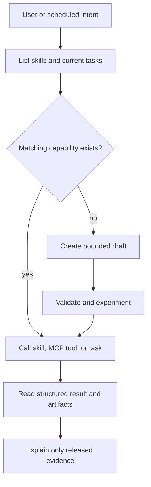

# Give the AI a Laboratory, Not a Shell

An LLM can help choose a discriminating measurement, connect a request to an
existing capability, or explain why a step failed. A camera still needs to
capture on time when the network is down, and a week-long monitor cannot depend
on one uninterrupted conversation.

Nora combines both strengths:

```text
scientific question -> repeatable task -> physical observation -> evidence
```

## A system that can keep working

| Runtime | Owns | Does not own |
|---|---|---|
| PicoClaw | Intent interpretation, capability selection, explanation, and chat/Telegram interaction | Continuous hardware loops or unverified board facts |
| nano-os-agent | Task execution, retries, timeouts, expectations, metrics, journals, and MCP tools | Open-ended scientific interpretation |
| Research engine | Bounded analyses over recorded evidence, and the verdict each one supports | Domain meaning, message delivery, or any action |
| Application adapter | Domain observations, proposal rules, and confirmed domain events | Universal hardware control or unrestricted action |

Note where the research engine sits. It reasons about data, deterministically
and within a budget, which is exactly the part of "reasoning" that does not
need an LLM at all.

The distinction is implemented in the runtime
([AGENTS.md](https://github.com/vbaulin/nora/blob/main/AGENTS.md) and
[HARDWARE_BOUNDARY.md](https://github.com/vbaulin/nora/blob/main/HARDWARE_BOUNDARY.md)),
not merely described in this tutorial.

## Start from what the instrument can already do

Before answering a board question, PicoClaw should inspect registered skills,
current nano-os-agent tasks, and existing artifacts. A current structured
result outranks chat history. If no capability exists, PicoClaw may design a
draft skill or task, but the new route still passes through validation.



## Why named capabilities matter

Direct shell access may look expedient, but it bypasses the controls needed on
a constrained edge board. Camera initialization, NPU memory, I2C writes, and
repeated monitors require retries, memory limits, evidence capture, and a clear
owner.

Use this order:

1. An existing MCP tool for an immediate one-shot operation.
2. A task YAML for an experiment, repeated measurement, or monitor.
3. A registered skill for a reusable board capability.
4. A draft skill followed by validation and promotion.

This separation is especially important after an error. A low-level failure is
evidence that a declared capability failed; it is not permission to replace the
task with unjournaled probing.

## Why it can work between visits

Autonomy does not require an LLM to remain awake. nano-os-agent can execute and
journal while PicoClaw is offline. A compact summary or released anomaly can
later wake the reasoning layer. The system is proactive because evidence can
initiate the next interaction, not because language controls the device every
second.

Next: [encode that deterministic work as a task](02-task-contract.md).
