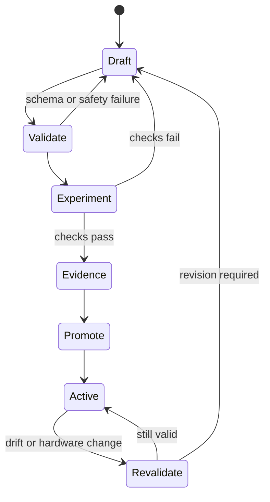

# Skills and the Hardware Boundary

A skill is a reusable capability with an explicit execution contract. The
directory contains `SKILL.md` plus an implementation such as a thin shell
wrapper, compiled helper, Python adapter, or native endpoint.

```yaml
---
name: my-sensor-snapshot
exec_type: shell
command: ./run.sh
input_format: env
output_format: json
timeout: 30
parameters:
  - name: bus
    type: integer
    default: 1
returns:
  - status
  - temperature_c
  - humidity_percent
---
```

The contract lets PicoClaw discover the capability and lets nano-os-agent
enforce a known execution route.

## Draft to active



The distinction prevents a plausible script from becoming an unattended board
capability merely because it ran once.

## Runtime preference

1. Native Go in `main.go` for deterministic primitives, MCP, task execution,
   safety checks, and journaling.
2. Vendor C/C++ binaries for camera, NPU, and zero-copy data paths.
3. Compiled Go helpers for CPU analysis, summaries, and validation.
4. Python for vendor bindings or rapid drafts that will later be validated.

The preferred path is:

```text
prototype -> validate repeatedly -> compile where useful -> promote
```

## Validation evidence

A useful validation task should test more than process exit status. Depending
on the skill, it can check:

- output schema and units;
- expected device identity;
- plausible physical range;
- artifact existence and non-zero size;
- repeated-run stability;
- memory and duration limits;
- failure behavior when the sensor is absent;
- comparison with a known reference or control.

Promotion retains the contract and the evidence that supported it. Later drift
or a changed device can trigger revalidation without changing the core task
engine.

## Why skills precede shell commands

A registered skill provides one location for safety, retries, board-specific
initialization, parsing, and structured output. A raw shell command spreads
those responsibilities into every caller and produces evidence that is harder
to interpret.

Next: [decide which task and skill results may become evidence](04-evidence-release.md).
