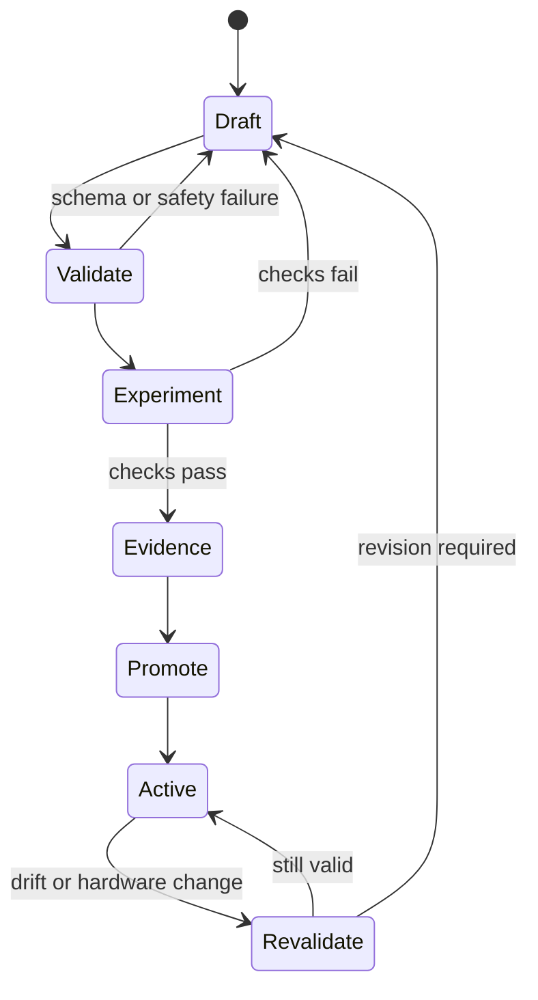

# Teach Nora a New Instrument

A skill is a reusable way to obtain an observation or perform a bounded
operation. It lets the next experiment ask for a temperature, image, spectrum,
or model result without rebuilding the device integration.

```yaml
---
name: my-sensor-snapshot
exec_type: shell
command: ./run.sh
input_format: env
output_format: json
timeout: 30
parameters:
  - name: bus
    type: integer
    default: 1
returns:
  - status
  - temperature_c
  - humidity_percent
---
```

The description lets PicoClaw discover the capability and gives nano-os-agent a
known way to execute and check it.

## From first reading to reusable method



The distinction prevents a plausible script from becoming an unattended board
capability merely because it ran once.

## Choose an implementation that fits the instrument

1. Native Go in `main.go` for deterministic primitives, MCP, task execution,
   safety checks, and journaling.
2. Vendor C/C++ binaries for camera, NPU, and zero-copy data paths.
3. Compiled Go helpers for CPU analysis, summaries, and validation.
4. Python for vendor bindings or rapid drafts that will later be validated.

The preferred path is:

```text
prototype -> validate repeatedly -> compile where useful -> promote
```

## Make the device earn unattended use

A useful validation task should test more than process exit status. Depending
on the skill, it can check:

- output schema and units;
- expected device identity;
- plausible physical range;
- artifact existence and non-zero size;
- repeated-run stability;
- memory and duration limits;
- failure behavior when the sensor is absent;
- comparison with a known reference or control.

Promotion retains the capability description and the evidence that supported it. Later drift
or a changed device can trigger revalidation without changing the core task
engine.

## Why the next experiment should reuse the skill

A registered skill provides one location for safety, retries, board-specific
initialization, parsing, and structured output. A raw shell command spreads
those responsibilities into every caller and produces evidence that is harder
to interpret.

Next: [keep the scientific notebook trustworthy](04-evidence-release.md).
