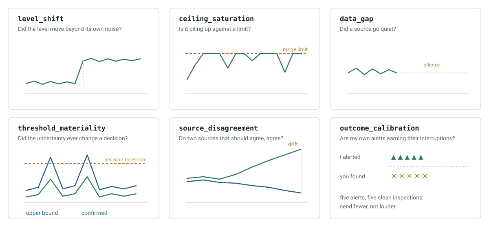

# Use Idle Time for Discovery

A board that samples once an hour is idle for fifty-nine minutes. Those minutes
are enough to answer questions about data already on disk. This chapter is the
engine that spends them: `skills/research_agent`.

It is domain-neutral. It knows about questions, analyses, findings, verdicts
and watches, and nothing about what the numbers mean.

## What happens between measurements


Three properties make this research rather than alerting:

- The question exists before the answer, and is stored with its provenance.
- The analysis reports what it *cannot* establish alongside what it can.
- A conclusion that changes no decision is a result, and stays silent.

## Where questions come from

**Signals.** A scan reads the tail of each monitor journal and looks for shapes
worth a closer look: a source that stopped reporting, a level that moved beyond
its own noise, a channel piling up against a limit. The scan concludes nothing;
it raises a question and hands it to an analysis.

**Human feedback.** Two refusals on the same subject are not stubbornness. They
are evidence that the board is asking the wrong question, or asking it too
often, so the engine opens a question about its own alerting threshold.

**Packs.** A domain declares the questions it always cares about. See
[chapter 8](08-vineyard-guard.md).

## The shapes it looks for

Every analysis is a shape in the data. These six are the core pictures; learn
them and you know most of what the board can notice on its own.



| Analysis | Question it answers |
| --- | --- |
| `level_shift` | Did the level move beyond its own noise? |
| `ceiling_saturation` | Is a channel piling up against a limit? |
| `data_gap` | Did a source go quiet? |
| `threshold_materiality` | Did the uncertainty ever change a decision? |
| `source_disagreement` | Do two sources that should agree, agree? |
| `outcome_calibration` | Are the board's own alerts earning their interruptions? |
| `neighbour_reports` | Do nearby reporters see something this board does not? |
| `baseline_deviation` | Is the current period unlike the periods before it? |
| `lagged_association` | Does one series move before another, by a fixed number of days? |
| `relationship_forecast` | A confirmed relationship's driver ran high: what would it imply, and when? |
| `coverage_gaps` | Which questions has the board framed that nothing here can measure? |

Three of these are what a networked board with a weather history is for.
`neighbour_reports` reads confirmed reports from other boards with their
distance and asks whether the local indicator agrees. A confirmation two
kilometres away raises the prior here and earns one cheap local check, nothing
more. `source_disagreement` between a weather forecast and what the station
later measured answers whether the forecast driving a risk projection can still
be trusted. `baseline_deviation` asks the question a person actually asks about
weather: not "is it warm" but "is this season unlike the last several".

## Forming a hypothesis nobody wrote down

Everything above answers a question somebody registered. That makes the board a
scheduler for a research catalogue: useful, but not a scientist. The step
across is schema discovery plus `lagged_association`. A domain pack points to
an evidence store. It does not list expected variables, divide the clock into
named agronomic periods, or prescribe candidate relationships.

For each SQLite table the engine infers a parseable temporal axis, changing
numeric columns, and repeated entity dimensions from cardinality and table
keys. Numeric JSONL channels are discovered in the same way. Every channel is
eligible to lead or respond. If a channel is subdaily, cyclic windows are
generated from its observed clock coverage and retained as hour ranges. A
surviving window may later be interpreted by a domain adapter, but the search
does not begin with words such as night, humidity, disease, camera, or sensor.

This means a newly connected instrument or a newly written model-output column
enters the hypothesis space on the next evidence cycle without a source-code
change. A channel that does not exist cannot become a speculative question.

### Why it does not find patterns in noise

A generator that proposes relationships will find them in randomness unless
every guard pushes toward the negative:

- the test runs on **first differences**, so two series that merely share a
  seasonal trend cannot produce a result;
- the effect must **persist in both halves** of the record with the same sign;
- significance is **corrected jointly for generated clock windows and lags**;
- a floor of **30 overlapping days** and a minimum effect size;
- a refuted pair **stays refuted** and is never proposed again.

Measured: 0 false positives in 200 trials of independent noise, 100% detection
of a moderate real lead. Pair discovery is budgeted at two new pairs per cycle.

It reports **precedence, never causation**. The question it asks is whether the
driver acts on the response, *or both follow something else*.

### Confirming is what starts a study

A pattern found in the record that produced it has been *described*, not
confirmed. So the first option on a hypothesis is not "act on it" but "shall I
test it properly?", and accepting it drafts a prospective study:

```yaml
- id: study_lagged_association_1
  name: "Prospective check: channel A precedes channel B"
  status: template          # the executor does not run a template
  steps:
    - id: measure
      action: call_skill
      parameters:
        skill_name: research_agent
        mode: investigate
        question_id: 1
      repeat:
        interval_sec: 604800
        max_iterations: 8
        journal_path: /tmp/monitors/study_lagged_association_1.jsonl
```

Re-running the same question weekly on data collected *after* the hypothesis
was formed is the cheapest honest experiment, and it needs no new hardware.

The draft is written as `status: template`, which the executor ignores.
Promoting it to `pending` is a human act. The board proposes an experiment; it
does not start one, and the skill name is validated and the repeat bounds
clamped before anything is written.

### When evidence is incomplete

A discovered pair can still return `insufficient_data` when fewer than 30
overlapping days remain after gaps and lags. That is a property of two series
the board actually holds. The engine does not manufacture an absent response
channel or ask a person to collect a preselected measurement. Coverage gaps are
reported separately from the open questions already present in evidence.

## From understanding to anticipation

A relationship the board found and a person confirmed can be pointed forwards.
The driver is watched; when it runs unusually high, the board reports the
observation and what it would imply:

```text
Channel A crossed its local high threshold on 2026-08-08. By the relationship
confirmed for this apparatus (rho 0.958 over 146 days), that would point at a
change in channel B around 2026-08-11: a projection of that relationship, not
a measurement.
```

The finding is still an observation first. The projection follows only when
there is a basis for it: below rho 0.5 or 60 observed days the board keeps
relating the two facts and says nothing about the future. Understanding is a
legitimate place to stop, and an unfounded prediction is worse than silence.

Two further guards: the driver must cross the 95th percentile of its own
history, since a threshold crossed one day in five warns about nothing; and the
predicted day must still be ahead, because a warning that arrives on the day it
predicts is news about the past.

## Attending to what is missing

Every analysis so far studies evidence that exists. `coverage_gaps` studies its
absence: it gathers the questions the board has framed and could not run,
groups them by the measurement each needs, and reports the register **once**.

```text
3 missing measurements. The most useful would be insect counts:
it would let me answer 2 questions I cannot answer now.
```

Once, not per blocked question. A board that repeats "I cannot test this"
every cycle has turned a gap into nagging. A gap describes the board's
instruments, not the field, and adding a measurement makes a question testable
rather than making its answer positive.

## Drafting a published model as a skill

Research sometimes finds a model in the literature that this board does not
have. It may be written down as a candidate skill, with sources attached and
only after a person agrees. The manifest carries `status: draft`,
`requires_validation: true`, its sources, and the checks it must pass, and it
lands where nothing discovers it as a capability.

The route refuses without a published source: a model nobody has written down
is a hypothesis, and this is for putting literature into testable shape, not
for inventing agronomy. A disease model is not a sensor driver, because its
output becomes treatment advice, so validation against confirmed local
outcomes and promotion stay separate human acts.

## Learning what to research

The board keeps a record of what its own research has been worth. An analysis
with no material finding after six attempts is demoted; one whose findings the
human keeps declining is demoted too, because that is evidence about the
question rather than about the human; a productive one gains a little.

Demoted, never silenced: an analysis that stops running can never earn its
place back, so the penalty is bounded and the floor is one.

Two boards do not have the same questions worth asking, and only a board's own
record can say which it is.

## Reusing a skill instead of reimplementing it

A board that already has a skill for seasonal averages should not have that
arithmetic written again inside an analysis. A source can name an installed
skill, or a glob of the artifacts a skill wrote, and any source may carry a
`refresh` that runs first:

```json
{"kind": "glob", "pattern": ".../results/season_climate_*_*.json",
 "refresh": {"kind": "skill", "name": "vineyard_season_climate",
             "params": {"mode": "report", "write_artifacts": true}}}
```

Vineyard Guard uses this separation in two complementary ways.
`vineyard-season-climate` writes human-readable annual artifacts and a daily
SQLite matrix of 18 unit-preserving environmental channels per field. Its EAV
adapter expands the observed field/metric dimensions, marks weather as an
environmental driver, and leaves response choice and lag discovery to the
generic engine. Disease outputs, image metrics, operations, phenology, and
fruit-composition observations can therefore become candidate responses
without adding a named agronomic correlation to the pack.

The daily deterministic refresh updates this matrix before the hourly idle
research loop. A cultivar literature profile supplies source-attributed prior
knowledge, but it cannot by itself release a harvest date: current local
phenology and composition measurements remain necessary.

A skill-backed question sets its own `min_interval_seconds`; reading a season
of weather is a weekly job, not an hourly one.

Each reads a JSONL journal or a local SQLite table, so anything nora already
records is a valid input. Most domain questions turn out to be one of these six
wearing different words.

## A worked study

Take the quickstart journal from the [index](index.md) and ask one question
directly instead of waiting for the scan:

```bash
printf '%s' '{"mode":"investigate","state_dir":"/tmp/nora-demo/state","analysis":"level_shift","subject":"light_probe","params":{"source":{"kind":"journal","path":"/tmp/nora-demo/monitors/light_probe.jsonl"},"key":"temp_c"}}' | ./skills/research_agent/run.sh
```

```json
{"status": "success", "mode": "investigate",
 "summary": [{"subject": "light_probe", "analysis": "level_shift",
              "verdict": "not_material", "sample_size": 48}]}
```

`not_material` is the answer, and nobody is interrupted by it. The stored
finding still carries the numbers that produced it:

```bash
printf '%s' '{"mode":"findings","state_dir":"/tmp/nora-demo/state","limit":1}' | ./skills/research_agent/run.sh
```

The `metrics` object holds `median_before`, `median_after`, `shift`,
`within_half_deviation` and `shift_threshold`. Anyone can check the reasoning
without rerunning it.

### Why the spread is measured within each half

A shift detector that measures noise across the whole window is defeated by the
shift itself: the step inflates the very spread it is compared against, and a
real change scores as ordinary variation. The engine measures the deviation
inside each half separately, so a step between two stable halves is significant
no matter how large it is.

This is the kind of detail that decides whether an autonomous researcher is
useful or merely busy.

## Why most analyses remain quiet

| Verdict | What happens |
| --- | --- |
| `material_unresolved` | Handed to an adapter, with options ordered by cost |
| `not_material` | Stored; the question is marked answered |
| `resolved_local` | Stored; the evidence already answered it |
| `insufficient_data` | Stored as an internal gap; never a human message |

An analysis that could not run is not a discovery. A board that lacks the data
to check something must not convert its blind spot into a request for
attention, budget, or hardware.

## Budget

One cycle is bounded by questions, seconds, files and lines:

```json
{"mode":"cycle","max_questions":3,"max_seconds":20,"max_files":12,"max_lines":400}
```

`tasks/029_autonomous_research_cycle.yaml` runs one every fifteen minutes and
journals the result. The defaults are sized so the research never competes with
sampling on a 256 MB board.

## Asking, and not insisting

A finding that reaches a human arrives with its numbers, with options ordered
by cost, and with "nothing for now" as a legitimate answer. The engine records
the reply:

```bash
printf '%s' '{"mode":"record_decision","state_dir":"/tmp/nora-demo/state","finding_id":1,"decision":"accepted","option_id":"check_source","watch":true,"note":"probe is capped at 100"}' | ./skills/research_agent/run.sh
```

An acceptance may arm a **watch**: a future action a human confirmed once. When
the same pattern returns, the watch fires and disarms. A refusal closes the
question for the season instead of rescheduling it, because "no" is an answer.

Hardware is never the first way to close a question, and never the only one. A
suggestion to buy something belongs at the end of a list whose first entry is
free, and it is not repeated after a refusal.

## Failure as diagnostic evidence

A failed or partial task run is excluded from advice, but it can open a
narrow investigation:

```text
Observed failure:
  sensor skill returned no device identity after two bounded attempts

Research question:
  which SG2002 I2C bus and voltage constraints apply to this sensor family?

Next experiment:
  read-only bus discovery followed by identity-register validation
```

The original failure is preserved, and a web answer never becomes a local
success.

## When local evidence is not enough

An external search is for the question the local analysis could not settle, and
it asks the scientific question. "Is a 95% humidity threshold a validated
wetness proxy?" is research. "Which humidity sensors should I buy?" is
shopping. Source-attributed results become candidate evidence for review, never
instructions, product selections, or confirmed facts.

## Model learning remains separate

Application models have their own training data, fitted parameters, evaluation,
release status, and version. Neither a promoted skill nor an LLM explanation is
a trained scientific model, and neither is a finding. This distinction matters
when boards exchange model deltas or when a fallback model is used before
enough confirmed local labels exist.

Next: [run and extend a first experiment](07-run-an-experiment.md).
