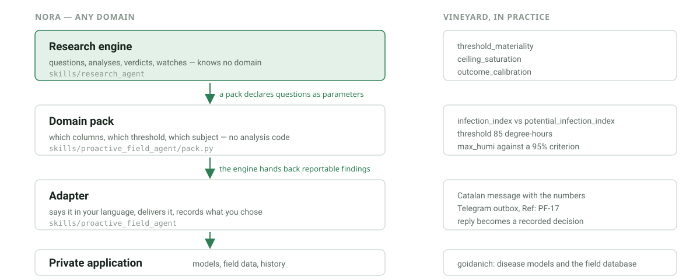

# Adapt It to Your Own Domain

Everything so far was domain-neutral on purpose. This chapter is where a field
of study plugs in. It has two parts: a **pack**, which tells the research engine
what questions your domain always cares about, and an **adapter**, which
delivers a finding to a human in their language and records the answer.



Vineyard Guard is the worked example. It is a complete application, not the
definition of nora.

## A pack is parameters, not code

The vineyard's canopy-wetness question looked domain-specific: a black-rot
infection index derived from rain and humidity, with an upper bound that
assumes near-saturated air also wets the leaves. Underneath, it is the shape
`threshold_materiality` already answers — two estimates of one quantity around
a decision threshold.

So the vineyard pack contains no analysis code at all. From
`skills/proactive_field_agent/pack.py`:

```python
{
    "subject": f"vineyard:{field_id}",
    "claim": "the unmeasured canopy-wetness assumption changes a black-rot decision",
    "analysis": "threshold_materiality",
    "params": {
        "source": black_rot_source(repo, field_id, [
            "infection_index", "potential_infection_index", "measured_wet_hours",
        ]),
        "lower_key": "infection_index",
        "upper_key": "potential_infection_index",
        "threshold": 85.0,
        "resolved_key": "measured_wet_hours",
        "coverage_tolerance": 2,
    },
}
```

The second vineyard question — whether the station serving a field can ever
reach the 95% humidity criterion the model depends on — is `ceiling_saturation`
with `criterion: 95.0`. The third, whether the board's alerts are earning their
interruptions, is `outcome_calibration` over its own proposals and the farmer's
confirmed outcomes.

A pack is one `pack.py` in a directory the engine scans:

```python
PACK = {
    "name": "my_domain",
    "questions": declare_questions,             # required in practice
    "journal_dirs": ["/tmp/monitors/my_domain"],  # optional
    "analyses": {"my_analysis": my_callable},     # optional, if a shape is genuinely new
    "calibration_sources": calibration_sources,   # optional
}
```

By default the engine scans the sibling skill directories, so installing a
domain skill registers its pack. A pack that raises on import is reported and
skipped: one broken domain must not stop the board from researching the others.

Verify yours is loaded:

```bash
printf '%s' '{"mode":"self_test"}' | ./skills/research_agent/run.sh
```

`checks.packs` lists what was found and `checks.pack_errors` explains what was
not.

## Write the domain questions before the code

Before parameterising anything, write the question in one sentence and say what
would change if the answer went either way. If nothing changes, it is not a
research question and the board should not spend its idle time on it.

Reach for a new analysis only when the shape is genuinely new. In practice most
domain questions are one of: two estimates around a threshold, a channel
against a limit, two sources that should agree, predictions against outcomes, a
source that stopped, a level that moved.

## The adapter delivers, the engine does not

The engine returns `reportable` findings and stops. An adapter decides who
hears about it, in what language, and how the answer comes back.

Vineyard Guard's adapter is `proactive-field-agent`. It:

- phrases a finding in the farmer's configured language, with its numbers;
- orders the options by cost, free first, hardware last and never alone;
- sends through the existing Telegram outbox with a `PF-<id>` reference;
- routes the reply back to a decision, never to a silent action;
- treats a refusal as an answer that closes the subject for the season.

A bench rig might print to a dashboard, open a ticket, or write a file. The
contract is the same: state the numbers, order the options by cost, and accept
"nothing for now".

### The difference this makes

The same board, the same watch flag, before and after the research step.

Before — a question dressed as a purchase:

```text
The data are compatible with a wet canopy, but no sensor confirms it. I propose
comparing a leaf-wetness sensor before treating this proxy as an operational
alert. Should I investigate it?
```

After — the board did the investigating first:

```text
Camp Nord: before writing to you I analysed 60 modelled days (2026-05-02 to
2026-06-30). On 2 days humidity sat between 90% and 95% without rain. 2 days
remain unresolved (upper bound reaches 118 degree-hours against 40 confirmed,
threshold 85): 2026-05-31, 2026-06-18. In addition, across 60 days the station
never recorded a single hour at or above 95% humidity despite 12 hours between
90% and 95%: that points at the model threshold for this station rather than an
isolated event. What I cannot settle from my own data is whether those 90-95%
hours wet the canopy, or whether the 95% threshold is unreachable here.
Options, cheapest first: 1) on a flagged morning, check whether the leaves are
wet at first light (three observations calibrate this field's threshold);
2) install a leaf-wetness sensor if you want a permanent answer; it is not
needed to carry on. Which would you like to start with? If none of them suit
you now, reply "none" and I will close it.
```

Same signal. The first message asks the farmer to fund the board's curiosity.
The second reports a study, admits its limit, and puts the free option first —
and if the ambiguity had never crossed the threshold, there would have been no
message at all.

## What Vineyard Guard adds beyond the pack

- field definitions and stable covariates from YAML;
- current dashboard state and PNG evidence for independent disease families;
- fresh daily cache and regeneration rules;
- farmer-facing report and alert policy;
- catalog-checked treatment and inspection capture;
- treatment and operation history;
- Supabase board, field, neighbour, event, and model synchronization;
- proposals grounded in released field evidence.

The private Goidanich repository supplies the disease models and the local
field database. nora supplies the executor, the skills, and the research
engine. Neither defines the other; see
[REPO_BOUNDARY.md](https://github.com/vbaulin/nora/blob/main/REPO_BOUNDARY.md).

## Why copy the example manifest?

The repository file
[`config/vineyard-board.example.json`](https://github.com/vbaulin/nora/blob/main/config/vineyard-board.example.json)
is a generic, version-controlled template. It should remain free of a real
farm's GPS coordinates, identities, private notes, and credentials.

For a disposable tutorial run:

```bash
cp config/vineyard-board.example.json /tmp/my-board.json
```

Edit `/tmp/my-board.json`, not the template. This avoids leaking deployment
identity, creating accidental Git changes, or cloning one board's UUID inputs
onto another board. For a persistent operator manifest, store it outside the
checkout, for example `$HOME/.config/nano-os-agent/boards/my-board.json`.

## Provision a field identity

```bash
python3 scripts/provision_vineyard_sd.py \
  --manifest /tmp/my-board.json \
  --rootfs /Volumes/rootfs \
  --fetch-sigpac \
  --require-sigpac
```

The provisioner validates that the target is a Linux root filesystem, creates
stable board and field identities, requires critical variety/age parameters,
records language and timezone, and can retain official SIGPAC lookup
provenance. It refuses to overwrite an existing configuration unless the
operator explicitly uses the force path, which first creates a backup.

## Observe before proposing

A scheduled proactive cycle is deterministic:

```json
{"mode":"tick","notify":true,"research":false}
```

The adapter reads fresh disease artifacts, confirmed operations, farmer
feedback, and released nano-os-agent results. It creates no more than one new
proposal per field. A proposal can ask for scouting, a missing protection
record, a stable field parameter, or a choice between the options of a finished
investigation.

It cannot apply a treatment.

## Confirm informal feedback

Suppose a farmer replies:

```text
PF-12: no symptoms; sulfur was applied yesterday.
```

The system first resolves `PF-12` without writing. Disease inspection and
treatment content is then sent to `farmer-feedback-capture` with
`confirmed=false`. The farmer receives a structured draft containing the field,
disease, date, product/catalog match, dose, area, water volume, and method.
Missing values become explicit questions. Only a corrected and confirmed second
call writes locally and synchronizes the event.

General operations such as pruning, mowing, soil work, irrigation,
fertilization, cover-crop work, harvest, planting, or sensor installation use
the adapter's separate draft/confirm operation route.

## Independent disease evidence

Downy mildew, powdery mildew, and grapevine black rot are separate model
families with separate caches, plots, and thresholds. The adapter keeps them
independent so a signal in one is never presented as evidence about another —
the same discipline the research engine applies to a subject and its analyses.

You have now seen the whole path: a deterministic executor, a skill lifecycle,
released evidence, one confirmable proposal, an engine that researches on idle
time, and a domain that plugs into it with parameters. Build the next pack for
your own instrument.
