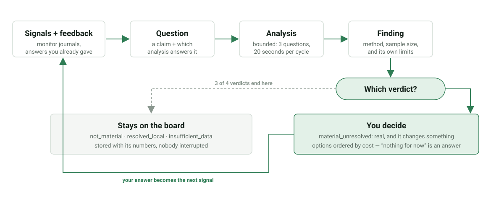
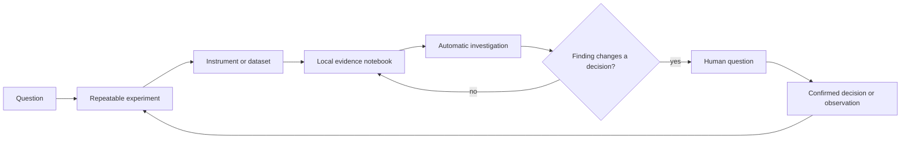

# Build a Scientific Observer That Works Between Visits

Suppose you need to follow a sample for three days, a fermentation for two
weeks, a machine through hundreds of cycles, or a vineyard through a growing
season. The difficult part is rarely taking one measurement. It is taking the
same measurement reliably, preserving its context, noticing an unexpected
change, and deciding what should happen next.

This tutorial builds that system with Nora.

By the end, your observer will be able to:

- run a declared experiment on a schedule without keeping an LLM online;
- collect measurements, images, audio, model outputs, and task outcomes;
- examine its own journals for shifts, gaps, saturation, disagreements, and
  relationships that were not named in advance;
- present a finding with the measurements that support it;
- ask a person one resolvable question through chat or Telegram;
- turn a confirmed reply into structured scientific context; and
- learn a new sensor or analysis method through validation and repeated tests.

The same code runs on a small RISC-V board, a laptop, or a cloud VM. Physical
instruments are optional for the first three chapters.

## Begin with a Research Situation

Choose one of these as a mental model. You can change applications later.

| Situation | Repetitive work Nora can take over | Judgment that remains human |
|---|---|---|
| **Microscope** | Capture, focus check, segmentation, growth metrics, denser sampling after change | Whether a morphology is scientifically meaningful |
| **Fermentation** | Temperature, image and audio trends, batch comparison, missing-sample detection | Manual density result, intervention, batch interpretation |
| **Machine** | Startup sequence, indicator reading, audio or vibration baseline, repeat measurement | Safety decision, maintenance authorization |
| **Field station** | Weather, canopy images, model runs, plots, cross-field comparison | Scouting result, operation, local agronomic context |
| **Uploaded dataset** | Schema discovery, anomaly screening, baseline comparison, candidate relationships | Study design, external validity, causal interpretation |

The tutorials use all five examples, but every chapter produces a reusable
piece of one system.

## The Finished Experience

A successful deployment is quiet most of the time.

```text
08:00  The observer completes its scheduled measurements.
08:02  New rows and artifacts enter the local notebook.
08:03  The research engine compares them with the subject's own history.
08:04  Ordinary variation is stored without a notification.
14:20  A persistent change appears in one channel.
14:21  Related channels and recent operations are checked locally.
14:22  The remaining uncertainty would change the next experiment.
14:23  One evidence-linked question reaches the operator.
14:41  The operator answers in ordinary language and confirms the structured record.
14:42  The next bounded experiment is queued.
```

This is proactive computing in a scientific setting. The software does not
need a person to remember the right question at the right time. It also does
not decide that a correlation is causal or that a proposed operation occurred.



## Try the Local Research Loop

The engine uses standard-library Python, so this demonstration needs no board
and no account.

```bash
git clone https://github.com/vbaulin/nora.git
cd nora
mkdir -p /tmp/nora-demo/monitors

python3 - <<'PY'
import datetime as dt
import json
import random

random.seed(1)
now = dt.datetime.now(dt.timezone.utc)
rows = [
    {
        "timestamp": (now - dt.timedelta(minutes=(48 - i) * 30)).isoformat(),
        "lux": min(100.0, round(random.gauss(86, 15), 1)),
        "temp_c": round(21 + random.gauss(0, 0.4), 2),
    }
    for i in range(48)
]
open("/tmp/nora-demo/monitors/light_probe.jsonl", "w").write(
    "\n".join(json.dumps(row) for row in rows)
)
PY

printf '%s' '{"mode":"cycle","state_dir":"/tmp/nora-demo/state","journal_dirs":"/tmp/nora-demo/monitors"}' \
  | ./skills/research_agent/run.sh
```

The light values repeatedly reach 100. The engine identifies a possible
measurement ceiling:

```json
{
  "status": "success",
  "raised": ["lux piles up against 100 instead of passing it"],
  "investigated": [{
    "subject": "light_probe",
    "analysis": "ceiling_saturation",
    "sample_size": 48,
    "verdict": "material_unresolved"
  }]
}
```

Nobody supplied a rule about `lux`. Nora inspected the timestamped numeric
channels and selected an analysis that matched the observed shape. The
temperature values did not support a finding, so the engine said nothing about
them.

## Why a Small Local Observer Changes the Cost of Research

Many studies fail to collect dense longitudinal evidence because expert time,
instrument integration, network access, or cloud processing is limited. A
small local runtime changes the division of labor:

- instruments perform the repeated observation close to the source;
- compact journals preserve months of measurements without one LLM call per
  sample;
- local analyses remove routine false alarms before they consume attention;
- confirmed human observations enter the same timeline as sensor and model
  results; and
- reusable skills reduce the cost of connecting the next instrument.

This does not make a low-cost board equivalent to a laboratory instrument. It
makes the board a persistent assistant around the instrument: one that can
follow a method, retain context, and prepare the next decision.

## What You Will Build



Nora uses four cooperating parts:

| Part | What you experience |
|---|---|
| **PicoClaw** | Chat, Telegram, model selection, skill discovery, explanations, and the web interface. |
| **nano-os-agent** | The process that keeps tasks running, handles temporary failures, and records what happened. |
| **Research engine** | The local investigator that compares series and decides whether a finding deserves attention. |
| **Application pack** | The scientific vocabulary, subject identities, models, and confirmation rules for your use case. |

## Learning Path

The chapter titles follow what you will accomplish, not the repository layout.

1. [Give the AI a laboratory, not a shell](01-reasoning-and-execution.md): connect open-ended reasoning to stable physical execution.
2. [Turn a question into a repeatable experiment](02-task-contract.md): describe steps, expected results, retries, and local monitoring.
3. [Teach Nora a new instrument](03-skill-lifecycle.md): package, test, and reuse a sensor or analysis capability.
4. [Keep the scientific notebook trustworthy](04-evidence-release.md): preserve source, freshness, uncertainty, and failed experiments.
5. [Let evidence start the conversation](05-proactive-dialogue.md): ask one question with enough context for an ordinary-language reply.
6. [Use idle time for discovery](06-research-and-adaptation.md): find patterns automatically, test them locally, and remember refuted leads.
7. [Run your first observer](07-run-an-experiment.md): start on a laptop, move to a board, and inspect the resulting artifacts.
8. [Build an application for your domain](08-vineyard-guard.md): add your own subjects and questions; use Vineyard Guard as a complete field example.

## What the System Can Learn

Several different processes produce durable change. The distinction matters
when you interpret the result.

| Learning process | What changes |
|---|---|
| **Evidence memory** | New measurements, images, task results, and confirmed observations join the subject's timeline. |
| **Research memory** | Supported findings and refuted candidate relationships affect what the engine investigates next. |
| **Sampling adaptation** | A declared policy changes sampling density or proposes a follow-up experiment within set limits. |
| **Skill learning** | A tested decoder, instrument action, or analysis becomes a reusable capability. |
| **Model learning** | An application fits versioned parameters from labelled data and records local evaluation. |
| **Federated learning** | An application may exchange selected model updates while measurements remain local. |
| **Human correction** | A confirmed label or operation changes the evidence available to later analyses. |

None of these turns temporal order into causality. A controlled experiment,
independent measurement, or appropriate statistical design is still required
for a causal claim.

## Where Nora Runs

| | Edge board | Laptop | Cloud VM |
|---|---|---|---|
| Experiment runner | yes | yes | yes |
| Research engine | yes | yes | yes |
| Application packs | yes | yes | yes |
| Camera, NPU, I2C, GPIO, audio | when attached | usually no | usually no |
| Typical evidence source | local instruments | files and development devices | APIs, uploads, databases |

The static Go executor builds for `riscv64`, `amd64`, and `arm64`. Skills
that need hardware identify that requirement and remain inactive on a host
without the device. The [off-board deployment guide](../../deploy/README.md)
covers systemd, containers, and cloud VMs.

## Continue

Start with [Chapter 1: Give the AI a laboratory, not a shell](01-reasoning-and-execution.md).

For a compact version of the entire course, use the
[single-page tutorial](../tutorial-proactive-field-companion.md).

### Method note

The chapter map uses the relationship-first approach of
[PocketFlow Tutorial Codebase Knowledge](https://github.com/The-Pocket/PocketFlow-Tutorial-Codebase-Knowledge).
The commands and runtime claims are checked against the current repository.
