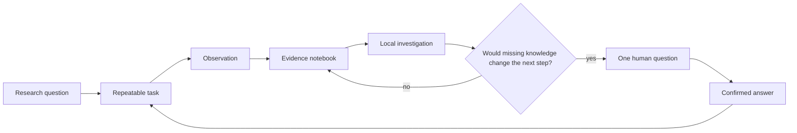

# Tutorial: Build a Scientific Observer That Can Follow Up

This tutorial turns one measurement into a self-running scientific workflow.
You will collect observations, investigate the resulting time series, create a
useful question from new evidence, and connect the answer to the next
experiment.

You can complete the data sections on a laptop. A LicheeRV Nano or another
Linux host is needed only when you connect a physical instrument.

The longer, chaptered version is available at
[vbaulin.github.io/nora](https://vbaulin.github.io/nora/).

## What You Are Building

Most monitoring systems stop after recording and alerting. This observer has a
longer loop:

```text
measure -> keep context -> compare with history -> investigate a change
        -> ask for missing human knowledge -> run the next bounded experiment
```

A microscope can increase sampling around a transition. A fermentation station
can request one manual density measurement when image and audio signals
disagree. A field board can compare weather, disease models, operations, and
inspection feedback. The machinery is the same in each case.



## 1. Choose the Unit You Want to Follow

Start with a subject, not a device. A subject is the entity whose history must
remain coherent:

- a sample under a microscope;
- one fermentation batch;
- a motor under a known operating load;
- a plant, plot, or environmental station;
- a robot and the object it is manipulating; or
- a dataset, simulation, or model version.

Write one initial question:

```text
Does sample A change growth regime during the next 24 hours?
```

Then name the observations that could answer it:

```text
image, capture time, focus score, illumination, object area, edge velocity
```

This small design step prevents the experiment from becoming a collection of
unrelated sensor readings.

## 2. Try Autonomous Investigation on a Laptop

Clone the repository and create a small journal:

```bash
git clone https://github.com/vbaulin/nora.git
cd nora
mkdir -p /tmp/nora-demo/monitors

python3 - <<'PY'
import datetime as dt
import json
import random

random.seed(1)
now = dt.datetime.now(dt.timezone.utc)
rows = [
    {
        "timestamp": (now - dt.timedelta(minutes=(48 - i) * 30)).isoformat(),
        "lux": min(100.0, round(random.gauss(86, 15), 1)),
        "temp_c": round(21 + random.gauss(0, 0.4), 2),
    }
    for i in range(48)
]
open("/tmp/nora-demo/monitors/light_probe.jsonl", "w").write(
    "\n".join(json.dumps(row) for row in rows)
)
PY
```

Ask the research engine to inspect the directory:

```bash
printf '%s' '{"mode":"cycle","state_dir":"/tmp/nora-demo/state","journal_dirs":"/tmp/nora-demo/monitors"}' \
  | ./skills/research_agent/run.sh
```

The light values accumulate at 100, so the engine raises a possible measurement
ceiling. It does not need a rule naming `lux`; it infers numeric channels from
the journal and matches the observed shape to a suitable analysis.

```json
{
  "status": "success",
  "raised": ["lux piles up against 100 instead of passing it"],
  "investigated": [{
    "subject": "light_probe",
    "analysis": "ceiling_saturation",
    "sample_size": 48,
    "verdict": "material_unresolved"
  }]
}
```

The temperature channel remains ordinary and produces no finding. The engine
stores that negative result so it does not repeatedly rediscover the same
unproductive question.

## 3. Express a Physical Observation as an Experiment

Build Nora for the host:

```bash
go build -o nora main.go

# Cross-build for the reference RISC-V board:
GOOS=linux GOARCH=riscv64 CGO_ENABLED=0 go build -o nora-riscv64 main.go
```

A task describes the operation, its time limit, and the result required for a
successful reading:

```yaml
- id: tutorial_system_snapshot
  name: "Tutorial system snapshot"
  priority: 1
  status: pending
  steps:
    - id: read_system
      action: call_skill
      save_as: system
      parameters:
        skill_name: system_info
      expect:
        ram_total_mb: ">=1"
      timeout: 15
      max_retries: 1
      on_fail: block
```

Run it:

```bash
/root/nano-os-agent/nano-os-agent --once tutorial_system_snapshot.yaml
tail -1 /root/nano-os-agent/experiments.jsonl
```

The journal tells you which steps ran, which checks passed, how long the task
took, and where its artifacts were written. A failed expectation remains
failed. Chat can explain the failure, but it cannot rewrite the experimental
record.

## 4. Turn One Reading into a Monitor

Add bounded repetition:

```yaml
- id: environmental_baseline
  name: "Environmental baseline"
  priority: 3
  status: template
  steps:
    - id: snapshot
      action: call_skill
      parameters:
        skill_name: sensor_fusion_snapshot
      expect:
        status: success
      timeout: 20
      repeat:
        interval_sec: 300
        max_iterations: 288
        journal_path: /tmp/monitors/environmental_baseline.jsonl
        continue_on_fail: true
```

This template describes one day of five-minute samples. Keep long examples at
`status: template` until you intentionally launch a pending copy.

Local repetition matters for cost and continuity. The board can collect 288
samples without 288 network requests or LLM turns. Later, `monitor_summary`
or the research engine reads the compact journal.

## 5. Let the Observer Find Questions

The research engine selects analyses from the shape of stored evidence. Current
analyses include:

| Observed shape | Scientific question |
|---|---|
| Persistent level change | Did the subject move beyond its usual variation? |
| Values crowding a limit | Is the sensor or model saturating? |
| Missing interval | Did the source stop observing? |
| Two sources diverge | Which measurement or assumption needs checking? |
| One series repeatedly moves first | Is the relationship stable enough to design a follow-up study? |
| Alerts disagree with confirmed outcomes | Should the local alert policy be recalibrated? |
| This season differs from previous periods | Which weather, operation, or sampling difference explains the deviation? |

Candidate relationships are generated from timestamped numeric channels rather
than a fixed list of expected correlations. The engine tests both halves of the
available window, corrects for the number of lags and clock windows considered,
and records rejected pairs. A surviving result supports a lead-lag hypothesis,
not a causal claim.

Four internal outcomes control attention:

| Outcome | What happens |
|---|---|
| The pattern matters and local evidence cannot settle it | It may become one human-facing finding. |
| The pattern is measurable but changes no decision | It stays in the notebook. |
| Existing observations already answer it | The answer is stored without asking anyone. |
| Data are insufficient to run the comparison | The gap is recorded, not presented as a discovery. |

## 6. Let Evidence Start a Conversation

A useful proactive message contains a subject, observation, uncertainty, one
request, and a stable reference:

```text
Microscope M1, sample A: focus quality fell from 0.78 to 0.41.
Illumination changed by less than 3%, so focus drift is the current
explanation, not a confirmed cause.

Proposed check: capture a three-position focus bracket.
Reply accept, defer, or correct.
Ref: MIC-41
```

An informal reply such as `yes, after lunch` becomes a draft:

```json
{
  "proposal_id": "MIC-41",
  "decision": "accepted",
  "not_before": "2026-08-02T14:00:00+02:00",
  "written": false
}
```

The operator confirms or corrects the draft. Only then is the decision written
and the task queued. After execution, the result again comes from the journal:

```text
MIC-41 completed. The center frame scored 0.43; the +0.4 mm frame scored 0.76.
No permanent camera setting was changed.
```

The same route handles labels, manual observations, operations, and corrections.
Ambiguous replies lead to one clarification rather than a guessed record.

## 7. Teach Nora a New Sensor

An unknown device becomes a reusable capability through experiments:

1. list the skills and current hardware map;
2. run read-only discovery;
3. identify candidate hardware from local evidence and source-attributed
   documentation;
4. draft a skill with declared inputs, units, and JSON output;
5. call `validate_skill`;
6. test repeated readings, range, missing-device behavior, memory, and timing;
7. promote the skill only after the declared checks pass; and
8. recheck it when hardware or behavior changes.

The task template
[`tasks/023_promote_learned_skill.yaml`](../tasks/023_promote_learned_skill.yaml)
implements the validation and promotion sequence.

For an I2C device, the first experiment should inventory addresses without
writing registers. A candidate datasheet can inform the decoder, but only
stable physical readings make that decoder eligible for unattended use.

## 8. Add an Application

The experiment runner and research engine are general. An application adds:

- subject identities and stable properties;
- the available observation stores;
- scientific questions that are always relevant;
- models and units specific to the field;
- operations and labels supplied by people;
- rules for deciding when a finding deserves a message; and
- a route from an accepted proposal to a named task or skill.

Keep measurements and credentials separate from reusable runtime code. A lab
can publish its instrument skill without publishing sample identities. A field
network can exchange selected model updates without centralizing all raw
observations. See
[Build Applications Without Giving Up Your Data](../REPO_BOUNDARY.md).

## 9. Example: Microscope Observer

The subject is `microscope_01/sample_A`. A repeated task records:

```json
{
  "subject_id": "microscope_01/sample_A",
  "observed_at": "2026-08-02T09:30:00+02:00",
  "focus_score": 0.78,
  "illumination_change_percent": 1.8,
  "object_count": 43,
  "median_area_px": 812,
  "edge_velocity_px_h": 2.4,
  "image_path": "/tmp/microscope/sample_A_0930.jpg"
}
```

When edge velocity changes, Nora checks focus and illumination before raising
a biological question. A confirmed high-frequency run produces dense images
around the transition. The original interval, trigger, confirmation, and
result remain in one timeline.

## 10. Example: Vineyard Guard

Vineyard Guard is the complete field application. Each plot has its own
identity, variety, weather history, disease models, operations, feedback, and
plots. A daily board cycle:

1. synchronizes selected network and feedback state;
2. refreshes weather and three independent disease families;
3. writes one current cache per field and disease;
4. sends one concise board summary;
5. attaches plots for active risks;
6. studies field history during idle time; and
7. asks the grower only for an observation or decision the board cannot make.

An informal reply such as `N2 is wet but I see no symptoms` is resolved to a
field and disease context, shown as a structured draft, and stored only after
confirmation. Treatment records follow the same two-step route and retain
product identity, dose, water volume, area, method, and date.

The field example demonstrates a general property: human observations are not
outside the data system. Once confirmed, they become timestamped evidence that
can test model alerts, calibrate local predictions, and guide the next study.

Use the detailed [Vineyard Guard guide](../VINEYARD_GUARD.md) and
[field application chapter](proactive-agent/08-vineyard-guard.md) for
provisioning and scheduler commands.

## 11. Inspect the System

On a configured board:

```bash
wget -qO- http://127.0.0.1:18790/health
wget -qO- http://127.0.0.1:18790/ready
/opt/picoclaw/picoclaw skills list
ls -1 /root/nano-os-agent/tasks
```

The web interface exposes the same working state:

```text
http://BOARD_IP:18800/runtime
http://BOARD_IP:18800/nano-os-agent
```

The Task Runner shows running and completed tasks, skills, experiment journals,
and rendered artifacts. Chat explains and starts work; it is not the source of
instrument state.

## 12. Before You Leave It Running

Confirm that:

- every physical operation has a named skill or task;
- tasks have time limits and bounded repetition;
- measurements include timestamp, unit, subject, and source;
- failed and partial outcomes remain visible;
- proposals and completed operations are distinct;
- consequential work requires the intended confirmation;
- external sources retain URLs and do not become instructions by themselves;
- raw measurements and secrets are stored where the study intends; and
- notification tests send human text and media rather than raw JSON or local
  file paths.

The design reasons behind these checks are explained in
[Working with Physical Hardware](../HARDWARE_BOUNDARY.md).

## Continue

- [Chaptered tutorial](https://vbaulin.github.io/nora/)
- [Application atlas](applications/)
- [Board installation](../INSTALL_BOARD.md)
- [Run on a laptop or cloud VM](../deploy/README.md)
- [Self-improving field and lab observer](applications/self-improving-field-lab-observer.md)
- [Automatic laboratory experiments](applications/automatic-lab-experiments.md)
