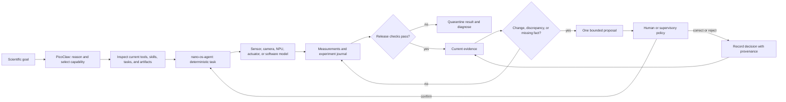

# Tutorial: Build a Proactive Scientific Companion

## From deterministic measurement to evidence-based dialogue

This tutorial explains how PicoClaw and nano-os-agent turn a small board into
a proactive scientific instrument. The system does not merely wait for a chat
question, and it does not let an LLM operate hardware continuously. It runs
bounded experiments, records evidence, detects a defined change or knowledge
gap, proposes one next action, and waits for confirmation when that action has
consequences.

Vineyard Guard is the complete worked application later in the tutorial. Its
farmer interaction demonstrates the general method; agriculture is not the
architecture.

At the end, you will understand how to:

- run a deterministic experiment independently of the LLM;
- distinguish measurement, memory, protocol adaptation, skill learning, and
  model training;
- turn released evidence into a concise proactive message;
- resolve informal human replies without silently changing state;
- validate and promote a new hardware skill;
- retain attributed internet research as candidate evidence;
- attach an application such as a microscope, fermentation monitor, machine
  health service, or Vineyard Guard;
- verify the existing farmer-facing reference deployment safely.

## 1. The general scientific loop

The platform separates reasoning from physical execution:



The loop is proactive because new evidence can initiate a proposal. It remains
controlled because the proposal is not the physical action.

Three runtimes carry different responsibilities:

| Runtime | Responsibility |
|---|---|
| PicoClaw | Interpret intent, inspect capabilities, select a skill or task, explain evidence, and communicate through chat or Telegram |
| nano-os-agent | Execute hardware and software steps with timeouts, retries, expectations, journals, and before/after metrics |
| Application adapter | Convert domain artifacts into observations, define proposal rules, and store confirmed domain events |

The current `proactive-field-agent` is one application adapter. It implements
the pattern for fields and Vineyard Guard. A microscope or fermentation
application should provide its own observation adapter and proposal policy
while reusing PicoClaw, nano-os-agent, the task runner, and the skill lifecycle.

## 2. What learning means here

The word *learning* covers five separate mechanisms. Keeping them separate
prevents chat history from being mistaken for experimental knowledge.

### 2.1 Evidence memory

The board accumulates timestamped measurements, artifacts, task verdicts, and
human-confirmed observations. Each item retains its source. A journal entry can
show that a focus score fell after six hours; it cannot by itself explain why.

### 2.2 Protocol adaptation

A deterministic policy can change the next measurement schedule within
declared bounds. For example, a microscope can move from one frame every ten
minutes to one frame per minute when a registered change-point detector fires.
The journal must record both the trigger and the new interval.

### 2.3 Skill learning

PicoClaw may propose or write a draft capability. nano-os-agent validates it
against explicit inputs, outputs, safety checks, and repeated experiments. The
skill becomes available for unattended use only after `validate_skill` and
`promote_skill` pass.

### 2.4 Model learning

Fitted parameters, classifiers, or federated model deltas belong to an
application training pipeline. Training data, model identity, evaluation, and
release status must be explicit. An LLM paraphrase is not model training.

### 2.5 Human correction

A human can label a false alarm, identify a sample, correct an operation, or
report an outcome. Free text first becomes a structured draft. It enters
evidence memory only after confirmation.

These mechanisms support useful adaptation without claiming causality. A later
observation can be linked to an earlier operation as a temporal association,
with `causal_claim=false`, until an experimental design supports a stronger
claim.

## 3. Verify the platform

You need a LicheeRV Nano board with PicoClaw and nano-os-agent installed. A
camera, sensor, or application repository is optional for the first read-only
experiment.

On the board, check the gateway:

```bash
wget -qO- http://127.0.0.1:18790/health
wget -qO- http://127.0.0.1:18790/ready
```

`/health` should report `status: ok`; `/ready` should report `status: ready`.

Inspect registered capabilities before trying hardware:

```bash
/opt/picoclaw/picoclaw skills list
ls -1 /root/nano-os-agent/tasks
```

The same information is available in the board web interface:

```text
http://BOARD_IP:18800/runtime
http://BOARD_IP:18800/nano-os-agent
```

The nano-os-agent page lists tasks, recent runs, skills, journals, and rendered
artifacts. It is the deterministic control surface. Chat is the reasoning and
explanation surface.

## 4. Run a first read-only experiment

Create a one-shot task on the board. This task reads system state and writes an
experiment record; it does not change hardware:

```bash
cat > /tmp/tutorial_system_snapshot.yaml <<'YAML'
- id: tutorial_system_snapshot
  name: "Tutorial system snapshot"
  priority: 1
  status: pending
  steps:
    - id: read_system
      action: call_skill
      save_as: system
      parameters:
        skill_name: system_info
      expect:
        ram_total_mb: ">=1"
      timeout: 15
      on_fail: block
YAML

/root/nano-os-agent/nano-os-agent \
  --once /tmp/tutorial_system_snapshot.yaml
```

Read the newest journal entry from the configured journal location:

```bash
tail -1 /root/nano-os-agent/experiments.jsonl 2>/dev/null \
  || tail -1 /tmp/experiments.jsonl
```

The important result is not prose. It is a task verdict linked to the executed
steps and their structured outputs. If the expectation fails, the result must
remain failed or partial. PicoClaw may diagnose it, but it may not relabel it as
success.

## 5. Extend one measurement into a monitor

A repeated task keeps sampling local and wakes the LLM only for a compact
summary or anomaly. Keep templates at `status: template` until an operator
intentionally launches them.

```yaml
- id: environmental_baseline
  name: "Environmental baseline"
  priority: 3
  status: template
  steps:
    - id: snapshot
      action: call_skill
      save_as: environment
      parameters:
        skill_name: sensor_fusion_snapshot
      expect:
        status: success
      timeout: 20
      repeat:
        interval_sec: 300
        max_iterations: 288
        journal_path: /tmp/monitors/environmental_baseline.jsonl
        continue_on_fail: true
```

This task produces one day of five-minute observations. A later
`monitor_summary` call can reduce those rows to extrema, trends, failures, and
representative artifacts. PicoClaw should reason over that compact evidence,
not hundreds of raw chat messages.

## 6. Make an experiment proactive

A proactive application needs seven explicit objects:

1. **Subject:** the instrument, sample, machine, plot, batch, or experimental
   unit being observed.
2. **Observation:** a current structured measurement with timestamp, source,
   units, freshness, and uncertainty.
3. **Trigger:** a declared threshold, discrepancy, missing fact, or change
   point.
4. **Proposal:** one bounded next observation, comparison, or operation.
5. **Confirmation rule:** whether a human must approve or correct the proposal.
6. **Executor route:** the exact nano-os-agent task or skill that performs it.
7. **Outcome rule:** what later evidence will close the proposal.

A minimal released observation can use this shape:

```json
{
  "subject_id": "microscope_01/sample_A",
  "observed_at": "2026-08-02T09:30:00+02:00",
  "measurement": "focus_score",
  "value": 0.41,
  "unit": "normalized_index",
  "source": "focus_quality_score@1.2.0",
  "freshness": "current",
  "uncertainty": "illumination changed by 3%",
  "experiment_verdict": "keep"
}
```

The adapter may then create a proposal:

```json
{
  "proposal_id": "MIC-41",
  "subject_id": "microscope_01/sample_A",
  "reason": "focus score fell below the validated 0.55 limit",
  "next_action": "capture a three-position focus bracket",
  "executor": "task:microscope_focus_bracket",
  "confirmation_required": true,
  "status": "proposed"
}
```

The proposal remains distinct from execution. This distinction is the core
safety property of proactive interaction.

## 7. Human interaction through chat or Telegram

The channel should transmit a short evidence statement, uncertainty, one
request, and a stable reference:

```text
Microscope M1, sample A: focus quality fell from 0.78 to 0.41.
Illumination remained within 3%, so focus drift is the current working
explanation, not a confirmed cause.

Proposed check: capture a three-position focus bracket.
Reply accept, defer, or correct.
Ref: MIC-41
```

If the operator replies `yes, do it after lunch`, the LLM resolves the
reference and creates a structured draft:

```json
{
  "proposal_id": "MIC-41",
  "decision": "accepted",
  "not_before": "2026-08-02T14:00:00+02:00",
  "written": false
}
```

The user confirms or corrects the draft. Only then is the decision written and
the deterministic task queued. A reply without a resolvable reference, subject,
or operation asks a clarification question instead of guessing.

After execution, the companion reports the outcome from task evidence:

```text
MIC-41 completed. The center frame scored 0.43; the +0.4 mm frame scored 0.76.
The result supports a focus-offset correction for this setup. No permanent
camera setting has been changed.
```

This pattern also works when no physical action is proposed. The companion can
ask for a manual label, a reference measurement, or permission to research a
method.

## 8. Use internet research without turning it into an instruction

When local evidence cannot answer a question, PicoClaw can run a bounded search
and retain:

- the exact query;
- source title and URL;
- provider and retrieval time;
- a short source snippet;
- the proposal that requested review.

Search output is candidate evidence. It cannot directly select a chemical,
change an actuator, establish a scientific fact, or promote a skill. The next
message should distinguish the source claim from the board observation:

```text
Two manufacturer documents recommend a focus bracket after thermal drift.
Our board measured a 6.2 C enclosure rise, but we have not tested whether that
temperature change caused this focus shift. Shall I run the bracket test?
```

The deployed field adapter tries Tavily, Brave, DuckDuckGo HTML, and
DuckDuckGo Lite in that order according to configured credentials and endpoint
availability. New applications can reuse the same source-attribution rule.

## 9. Learn a new hardware skill

Unknown hardware follows a release process rather than direct shell probing:

1. inspect current skills, tasks, and the hardware capability map;
2. run a read-only discovery task;
3. create a draft skill with declared inputs and JSON outputs;
4. call `validate_skill`;
5. run repeated experiments with explicit expectations;
6. retain representative artifacts and failure cases;
7. call `promote_skill` only after the checks pass;
8. monitor drift after promotion.

The repository template
[`tasks/023_promote_learned_skill.yaml`](../tasks/023_promote_learned_skill.yaml)
shows the validation and promotion chain.

For example, an unrecognized I2C device should first produce a read-only bus
inventory. PicoClaw may research candidate part numbers and draft a decoder.
nano-os-agent then tests stable register reads. Only a validated decoder becomes
an unattended sensor skill. A partial experiment remains quarantined.

## 10. Learning examples across applications

### Microscope timelapse

Observation: crystal-edge velocity rises abruptly after six hours.

Proactive response: increase sampling for a bounded interval, preserve frames
before and after the transition, and ask whether the operator wants a repeat at
the same temperature.

Learning: the protocol now has evidence for where dense sampling is useful. It
does not yet prove the transition mechanism.

### Fermentation monitor

Observation: bubble activity falls while temperature remains stable.

Proactive response: request one manual density measurement instead of declaring
a stalled fermentation. After confirmation, compare the manual result with
audio and image signals.

Learning: confirmed pairs can calibrate a local proxy or form labelled training
data for a later model.

### Machine health

Observation: a motor vibration spectrum gains a persistent sideband after a
load change.

Proactive response: ask for the operating load and schedule a short repeat
measurement. Do not stop the machine unless an explicit safety controller owns
that decision.

Learning: the board builds a machine-specific baseline and preserves the
conditions under which the sideband appeared.

### New environmental sensor

Observation: I2C discovery repeatedly finds the same unknown address.

Proactive response: propose a read-only identification experiment, research
public datasheets, validate a draft decoder, and ask the operator to confirm
the physical sensor model.

Learning: a promoted skill becomes a reusable board capability. A guessed part
number does not.

## 11. Worked application: Vineyard Guard

Vineyard Guard demonstrates the full loop with field YAML, three independent
disease families, weather forecasts, plots, Supabase synchronization, farmer
feedback, treatment records, and Telegram delivery.

The phrase "the plant talks to the farmer" is an interface metaphor. The plant
is not treated as a literal speaker. Farmer-facing claims must come from:

1. a current measurement or disease-model result;
2. a reviewed stable field property;
3. a farmer-confirmed operation or observation;
4. a cited external source retained for review.

### 11.1 Why copy the example manifest?

The provisioning guide starts with:

```bash
cp config/vineyard-board.example.json /tmp/my-board.json
```

`config/vineyard-board.example.json` is a version-controlled template. It must
remain generic so a pull, test, or new installation starts from reviewed
defaults. Editing it directly is technically possible, but it creates four
avoidable problems:

- real board IDs, coordinates, and farm metadata can be committed by mistake;
- the repository becomes dirty for every deployment;
- future template changes produce merge conflicts with one farm's values;
- a second board may inherit the first board's identity.

The `/tmp` copy is deliberately disposable for a tutorial or one-time SD-card
provisioning run. For a long-lived private manifest, store it outside the Git
checkout, for example:

```bash
mkdir -p "$HOME/.config/nano-os-agent/boards"
cp config/vineyard-board.example.json \
  "$HOME/.config/nano-os-agent/boards/my-board.json"
```

Pass that path to the provisioner. The source template remains untouched.

### 11.2 Provision field identity

Edit the private manifest with a unique board ID and one unique ID per physical
field. Record at least the display name, GPS coordinates, variety, and planting
year or vine age.

Preview before writing an SD-card root filesystem:

```bash
python3 scripts/provision_vineyard_sd.py \
  --manifest "$HOME/.config/nano-os-agent/boards/my-board.json" \
  --rootfs /Volumes/rootfs \
  --dry-run
```

The complete SIGPAC and first-boot procedure is in
[Vineyard board and SD-card provisioning](vineyard-sd-card-provisioning.md).

### 11.3 Synchronize the application runtime

From this repository:

```bash
BOARD=root@192.168.36.102 \
SSH_OPTIONS='-o StrictHostKeyChecking=no' \
./scripts/sync_vineyard_board.sh
```

The script synchronizes runtime contracts, Vineyard Guard skills, scheduler
scripts, the proactive adapter, and selected Goidanich application files. It
keeps `/root/nano-os-agent/skills` authoritative and bind-mounts those skills
into the PicoClaw workspace. It does not copy this tutorial or the rest of the
repository documentation because those files are not required at runtime.

### 11.4 Verify the field adapter

On the board:

```bash
/opt/picoclaw/picoclaw skills list | grep -E \
  'proactive-field-agent|farmer-feedback-capture|farmer-notify|daily-vineyard-briefing'

printf '%s\n' '{"mode":"self_test"}' \
  | /root/nano-os-agent/skills/proactive_field_agent/run.sh \
  | python3 -m json.tool
```

A ready deployment reports `installed=true`, `operational_ready=true`, SQLite
integrity `ok`, configured fields, and current downy-mildew, powdery-mildew,
and black-rot state for every field.

### 11.5 Run an isolated proactive cycle

Use temporary state so the tutorial cannot alter production proposals:

```bash
export DEMO_STATE=/tmp/proactive-field-tutorial
export GOIDANICH=/root/.picoclaw/workspace/goidanich

SKILL_MODE=observe \
SKILL_STATE_DIR="$DEMO_STATE" \
SKILL_REPO_PATH="$GOIDANICH" \
  /root/nano-os-agent/skills/proactive_field_agent/run.sh \
  | python3 -m json.tool

SKILL_MODE=tick \
SKILL_STATE_DIR="$DEMO_STATE" \
SKILL_REPO_PATH="$GOIDANICH" \
  /root/nano-os-agent/skills/proactive_field_agent/run.sh \
  | python3 -m json.tool
```

Read the result by role:

- `profiles` are reviewed field identities and stable covariates;
- `observations` are current model, sensor, or experiment results;
- `operations` are confirmed farmer records;
- `facts` preserve provenance and confidence;
- `proposals` are unexecuted candidate next steps;
- `decisions` are explicit farmer responses;
- `next_research` is a queued question, not an answer.

An empty proposal list is valid when no action or clarification is needed.

### 11.6 Farmer interaction example

Assume the board sends:

```text
N1 Chardonnay demana una inspecció del dosser.
Evidència: senyal meteorològic de Black rot de la vinya
(Guignardia bidwellii) i vigilància d'oïdi.
No és una ordre de tractament.
Ref: PF-12
```

The farmer replies informally:

```text
PF-12: cap símptoma
```

The gateway first resolves context without writing:

```bash
printf '%s\n' \
  '{"mode":"proposal_context","raw_text":"PF-12: cap símptoma"}' \
  | /root/nano-os-agent/skills/proactive_field_agent/run.sh \
  | python3 -m json.tool
```

Because the proposal mentions two diseases, the adapter asks which disease the
inspection concerns. For one resolved disease it returns `written=false`, the
field, the disease, and `next_route=farmer-feedback-capture`.

`farmer-feedback-capture` then produces a structured draft. Only the second
call with `confirmed=true` writes the event, refreshes the relevant dashboard,
and synchronizes it with Supabase. Accepting PF-12 does not authorize a
treatment.

General operations such as pruning, mowing, soil work, irrigation,
fertilization, harvest, or sensor installation use `draft_operation` followed
by explicit `record_operation` confirmation. Treatments and disease
inspections remain on the product-catalog-aware feedback route.

### 11.7 Daily proactive schedule

BusyBox `crond` invokes `scripts/vineyard_guard_tick.sh` every five minutes.
Dated stamps and locks make each stage run at most once per local day:

| Local time | Stage |
|---|---|
| 07:55 | Synchronize board identity, neighbours, feedback events, and model deltas with Supabase |
| 08:00 | Refresh weather, forecasts, dashboards, reports, and plots |
| 08:15 | Evaluate downy mildew, powdery mildew, and grapevine black rot independently; package one daily summary |
| 08:35 | Ingest evidence, create bounded proposals, run at most one queued research request, and suppress duplicates |
| 17:00 | Ingest later operations or observations and create a follow-up only when justified |

The three disease families remain independent. A low result in one cannot
suppress an alert or plot from another. A proactive proposal already covered
by the daily report is retained as evidence and skipped for duplicate delivery.

### 11.8 Test Telegram packaging without sending

```bash
export PICOCLAW_OUTBOX=/tmp/proactive-field-tutorial-outbox
mkdir -p "$PICOCLAW_OUTBOX"

printf '%s\n' \
  "{\"mode\":\"tick\",\"state_dir\":\"$DEMO_STATE\",\"repo_path\":\"$GOIDANICH\",\"notify\":true}" \
  | /root/nano-os-agent/skills/proactive_field_agent/run.sh \
  | python3 -m json.tool

set -a
. /root/.picoclaw/telegram.env
set +a

python3 /root/.picoclaw/workspace/scripts/telegram_outbox_sender.py \
  --outbox "$PICOCLAW_OUTBOX" \
  --once \
  --dry-run
```

`--dry-run` validates recipients and media without sending or marking a package
as delivered. Remove only the isolated tutorial data when finished:

```bash
rm -rf "$DEMO_STATE" "$PICOCLAW_OUTBOX"
```

## 12. Audit and safety checklist

Before unattended operation, verify:

- [ ] `/health` returns `ok` and `/ready` returns `ready`.
- [ ] every physical action has a nano-os-agent skill or task route.
- [ ] experiment verdicts preserve failed, partial, and blocked outcomes.
- [ ] measurements include units, timestamps, source, and freshness.
- [ ] a proposal is not represented as an executed action.
- [ ] consequential operations require explicit confirmation.
- [ ] later outcomes are not converted automatically into causal claims.
- [ ] web sources retain URLs and remain candidate evidence.
- [ ] draft skills pass validation and repeated experiments before promotion.
- [ ] chat history is never used as current instrument or field state.
- [ ] Telegram sends human text and media, not raw JSON or local file paths.
- [ ] secrets do not appear in Git, traces, reports, or screenshots.

For Vineyard Guard, also verify current state for all three diseases, a dry-run
of the Telegram outbox, successful daily scheduler stamps, and an ambiguous
multi-disease reply that asks for clarification.

## 13. Where state lives

General nano-os-agent evidence is stored in the configured experiment journal,
task state, monitor journals, and artifact directories. The web Task Runner
renders those artifacts without making chat the source of truth.

The Vineyard Guard reference adapter adds:

```text
/root/.picoclaw/workspace/proactive_field/proactive_field.db
/root/.picoclaw/workspace/proactive_field/traces.jsonl
/root/.picoclaw/workspace/goidanich/results/
/tmp/picoclaw_outbox/
/tmp/vineyard_guard_cron.log
```

Use skill APIs rather than editing SQLite manually. The trace rotates at 1 MB
and redacts credential-like top-level fields. `/tmp` contains transient media
and should have enough free space for current plots and experiment artifacts.

## Further reading

- [PicoClaw and nano-os-agent web integration](picoclaw-nano-webapp-integration.md)
- [Automatic lab experiments](applications/automatic-lab-experiments.md)
- [Microscope timelapse station](applications/microscope-timelapse.md)
- [Scientific reflexes](applications/scientific-reflexes.md)
- [Self-improving field and lab observer](applications/self-improving-field-lab-observer.md)
- [Waku-Agent patterns in the proactive field loop](waku-agent-proactive-field-integration.md)
- [Vineyard Guard runtime](../VINEYARD_GUARD.md)
- [Vineyard board and SD-card provisioning](vineyard-sd-card-provisioning.md)
