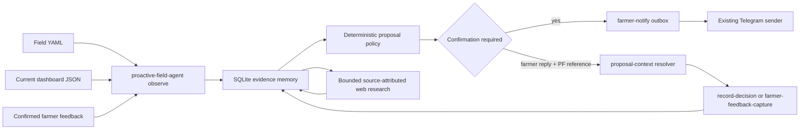

# Waku-Agent Patterns in PicoClaw's Proactive Field Loop

For the general experiment, learning, and interaction architecture followed by
the Vineyard Guard deployment example, see
[Tutorial: build an autonomous research executor](tutorial-proactive-field-companion.md).

## Patterns Adopted

1. **Bounded observe-propose-confirm loop.** One cycle observes local evidence,
   derives at most one new proposal per field, and stops. It never loops until
   an LLM decides to stop.
2. **Evidence memory.** SQLite stores field profiles, compact observations,
   farmer operations, facts, research requests/sources, proposals and farmer
   decisions. Every item retains provenance and confidence.
3. **Selective retrieval.** Chat or Telegram reads proactive memory only for
   questions about learned field state, operations, possible improvements or
   proposed actions. Disease values still come from the current disease skill.
4. **Traceable research.** A bounded web search stores title, URL, snippet,
   provider and retrieval time. Search output is candidate evidence and cannot
   directly create a treatment order.
5. **Deterministic consolidation.** Confirmed operations and later confirmed
   outcomes are linked as observed sequences. Unlike Waku's general chat
   summarizer, the board does not ask an LLM to infer agronomic facts from
   conversation text and never promotes temporal order into a causal claim.
6. **Experiment release gate.** A current nano-os-agent experiment contributes
   a field fact only when its declared verdict and step counts pass. Partial,
   failed, blocked or inconsistent runs are quarantined, automatically queue
   one bounded remedy search, and cannot influence farmer advice.
7. **Router/procedure separation.** The intent router is an invisible front
   door evaluated for each farmer message; named skill modes are bounded
   procedures invoked only after routing. PicoClaw implements this distinction
   in its native Telegram tool-first route rather than importing Waku's slash
   command or dashboard layer.

These patterns correspond to Waku's transparent agent loop, retrieval gate,
memory consolidation, web-search tool, JSONL tracing and release/evaluation
gate:

- [Waku Agent repository](https://github.com/ShenSeanChen/waku-agent)
- [Agent loop](https://github.com/ShenSeanChen/waku-agent/blob/main/waku/loop/agent.py)
- [Retrieval gate](https://github.com/ShenSeanChen/waku-agent/blob/main/waku/memory/retrieval_gate.py)
- [Memory consolidation](https://github.com/ShenSeanChen/waku-agent/blob/main/waku/memory/consolidation.py)
- [Web search](https://github.com/ShenSeanChen/waku-agent/blob/main/waku/tools/search.py)
- [Tracing](https://github.com/ShenSeanChen/waku-agent/blob/main/waku/ops/tracing.py)
- [Release gate](https://github.com/ShenSeanChen/waku-agent/blob/main/waku/ops/release_gate.py)
- [Router front door](https://github.com/ShenSeanChen/waku-agent/blob/main/waku/ops/triage.py)
- [Named workflow procedures](https://github.com/ShenSeanChen/waku-agent/blob/main/waku/ops/commands.py)

## Runtime Architecture



The plant-facing language is deliberately constrained. The board may say that
a field "asks for a check", but it must identify the measured/model evidence.
It cannot claim unseen plant physiology, confirmed infection, or treatment.

## State Model

The default database is:

```text
/root/.picoclaw/workspace/proactive_field/proactive_field.db
```

Tables have separate epistemic roles:

| Table | Meaning |
|---|---|
| `field_profiles` | Current configured identity and stable covariates |
| `observations` | Compact dashboard/model observations with freshness |
| `operations` | Confirmed local feedback/treatments ingested from Goidanich |
| `facts` | Configured, observed, provisional or farmer-confirmed facts |
| `research_requests` | Questions queued because local evidence is insufficient |
| `research_sources` | Public URLs and snippets returned for those questions |
| `proposals` | Unconfirmed, deduplicated candidate next actions |
| `decisions` | Farmer acceptance, rejection, deferral or correction |

`traces.jsonl` records bounded mode starts/completions and errors. It is rotated
at 1 MB and strips values whose keys resemble credentials.

The `facts` table also contains deterministic operation-follow-up associations.
Each one preserves the source operation, later outcome, dates, disease context,
and `causal_claim=false`. This gives the board durable field learning without
claiming that an intervention caused the subsequent observation.

## Skill Modes

```bash
printf '%s' '{"mode":"tick","notify":false}' \
  | /root/nano-os-agent/skills/proactive_field_agent/run.sh

printf '%s' '{"mode":"status"}' \
  | /root/nano-os-agent/skills/proactive_field_agent/run.sh

printf '%s' '{"mode":"record_decision","proposal_id":12,"decision":"deferred","note":"Inspect tomorrow"}' \
  | /root/nano-os-agent/skills/proactive_field_agent/run.sh

printf '%s' '{"mode":"proposal_context","raw_text":"PF-12: cap símptoma"}' \
  | /root/nano-os-agent/skills/proactive_field_agent/run.sh

printf '%s' '{"mode":"self_test"}' \
  | /root/nano-os-agent/skills/proactive_field_agent/run.sh
```

`research` uses Tavily when `TAVILY_API_KEY` is available, then Brave when
`BRAVE_SEARCH_API_KEY` is available, and otherwise tries DuckDuckGo HTML then
DuckDuckGo Lite through the Python standard library. The Lite retry is used
when the HTML endpoint returns a challenge page or no parseable results. The
keys may live in
`/root/.picoclaw/search.env` or the application `.env`; only those two
whitelisted names are parsed. The search layer rejects local/private result
URLs and reads at most 512 kB from a fixed provider endpoint. An external
research tool can instead supply source objects to `mode=ingest_research`.

## Scheduling and Telegram

The deterministic BusyBox tick runs:

- the proactive cycle after the daily three-disease evaluation, with at most
  one queued web search;
- a second observation cycle in the late afternoon to ingest new operations;
- the existing `farmer-notify` outbox and sender for delivery.

Only unnotified farmer proposals at or above the configured priority threshold
are packaged. Internal cache-refresh proposals are never sent. Alert proposals
carry the exact alert disease IDs and attach only those diseases' current PNGs.
If the deterministic daily health briefing already covers the same field and
disease, the proposal is marked `skipped_covered` rather than creating a second
Telegram message. Pending proposals, cooldowns, outbox hashes and proposal IDs
prevent repeated messages.

The same loop checks confirmed field operations after operation-specific
delays. If pruning, mowing, soil work, irrigation, fertilization, cover-crop
work, planting, harvest, sensor installation, or treatment has no later
confirmed outcome, it asks one concise follow-up through Telegram. The reply is
drafted and confirmed before storage. A later confirmed outcome closes the
proposal automatically, preventing an answered question from remaining active.

Field-related nano-os-agent experiments use the same discipline as Waku's
release gate. A passing run becomes an `observed_success` fact scoped to that
single experiment. A failed or partial run creates an internal
`experiment_investigation`; the raw measurement is withheld, and the morning
research cycle searches for official or vendor troubleshooting evidence. Only
a source-attributed `research_review` can then reach Telegram.

Product, dose and treatment capture remains separate. Natural-language farmer
input first passes through `farmer-feedback-capture confirmed=false`, is shown
back as a structured draft, and is stored only after explicit confirmation.
The proactive cycle then ingests the confirmed operation.

Short outcomes such as `cap símptoma`, `fals avís`, `sin síntomas`, or
`compatible symptoms` first pass through `proposal_context`. An exact PF
reference is preferred; without one, context is used only when exactly one
field-check proposal is active. If several fields or disease models are
possible, the board asks one localized clarification question. It never
defaults an ambiguous observation to downy mildew.

Source-attributed research reviews have priority 70, equal to the default
proactive notification threshold. Thus a bounded search can produce a cautious
farmer-facing candidate solution; snippets remain review material and cannot
select a product, dose, treatment, or hardware action automatically.

For grapevine black rot, a weather-model threshold is communicated even when
local inoculum remains `unknown`. The message preserves the infection index in
degree-hours, event date, wetness source, and plot, and labels the result as an
unconfirmed weather-model signal. A person's lack of previous observation is
not encoded as regional absence. Confirmed compatible symptoms can promote
local field evidence to `present`; clean/false-alarm feedback calibrates that
field/date without asserting absence elsewhere.

General farming operations use `draft_operation` and `record_operation` so the
same memory can represent pruning, mowing, soil work, irrigation,
fertilization, cover crops, harvest, planting and sensor installation. The
field and ISO date/time are mandatory and nothing is written before explicit
confirmation. Treatments and disease inspections are deliberately redirected
to the catalog-aware, Supabase-synchronized `farmer-feedback-capture` route.

## Verification

Run the focused tests with:

```bash
python3 -m unittest discover -s tests -p 'test_proactive_field_agent.py'
python3 -m unittest discover -s tests -p 'test_vineyard_guard_cron.py'
```

The tests cover stale-data blocking, proposal deduplication, non-executing
farmer decisions, uncertain-wetness research, public-source validation and
single-package Telegram delivery. `self_test` separately reports installation
health and operational cache readiness, so stale disease data cannot be
mistaken for a broken skill deployment.

## Limits

- This is not a causal agronomy engine. Proposals are bounded operational
  hypotheses that require confirmation.
- Search snippets do not establish scientific validity. Primary papers,
  extension guidance and official product registrations must be checked before
  use.
- Stable covariates such as variety, planting year/vine age and rootstock must
  be configured or farmer-confirmed before they influence cross-board models.
- Autonomous hardware experiments still run through nano-os-agent task/skill
  safety boundaries, not through this SQLite layer.
